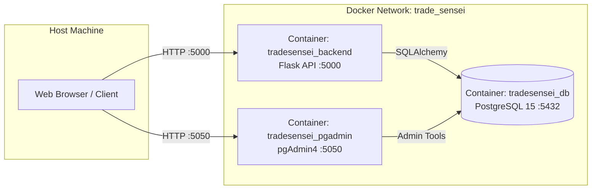

# ภาคผนวก ก

# คู่มือการติดตั้งและกำหนดค่าระบบ (Installation & Configuration Guide)
## โครงการ TradeSensei — ระบบสนับสนุนการวิเคราะห์และทำนายราคาหุ้นด้วยปัญญาประดิษฐ์
### (AI-Powered Stock Market Analysis & Forecasting Platform)

---

## สารบัญ

* [ก.1 บทนำและความต้องการของระบบ (Prerequisites & Environment)](#ก1-บทนำและความต้องการของระบบ-prerequisites--environment)
  * [ก.1.1 ข้อกำหนดด้านฮาร์ดแวร์ (Hardware Specifications)](#ก11-ข้อกำหนดด้านฮาร์ดแวร์-hardware-specifications)
  * [ก.1.2 ข้อกำหนดด้านซอฟต์แวร์และเครื่องมือที่ต้องติดตั้งล่วงหน้า (Prerequisite Software)](#ก12-ข้อกำหนดด้านซอฟต์แวร์และเครื่องมือที่ต้องติดตั้งล่วงหน้า-prerequisite-software)
  * [ก.1.3 โครงสร้างโฟลเดอร์ของโครงการ (Project Directory Structure)](#ก13-โครงสร้างโฟลเดอร์ของโครงการ-project-directory-structure)
* [ก.2 การกำหนดค่าตัวแปรสภาพแวดล้อม (Environment Configuration: .env)](#ก2-การกำหนดค่าตัวแปรสภาพแวดล้อม-environment-configuration-env)
  * [ก.2.1 รายละเอียดตัวแปรความปลอดภัยและคีย์ระบบ](#ก21-รายละเอียดตัวแปรความปลอดภัยและคีย์ระบบ)
  * [ก.2.2 การตั้งค่าฐานข้อมูล PostgreSQL และ pgAdmin](#ก22-การตั้งค่าฐานข้อมูล-postgresql-และ-pgadmin)
  * [ก.2.3 การตั้งค่า Google Gemini AI API Key](#ก23-การตั้งค่า-google-gemini-ai-api-key)
  * [ก.2.4 การตั้งค่า Google OAuth 2.0 Client ID สำหรับ Web Application](#ก24-การตั้งค่า-google-oauth-20-client-id-สำหรับ-web-application)
  * [ก.2.5 การตั้งค่าบริการส่งอีเมล OTP (Resend API)](#ก25-การตั้งค่าบริการส่งอีเมล-otp-resend-api)
  * [ก.2.6 การตั้งค่า CORS_ORIGINS และ Rate Limiting](#ก26-การตั้งค่า-cors_origins-และ-rate-limiting)
* [ก.3 ขั้นตอนการติดตั้งและรันระบบผ่าน Docker Compose (Production Deployment)](#ก3-ขั้นตอนการติดตั้งและรันระบบผ่าน-docker-compose-production-deployment)
  * [ก.3.1 การจัดเตรียมไฟล์คอนฟิก (.env)](#ก31-การจัดเตรียมไฟล์คอนฟิก-env)
  * [ก.3.2 คำสั่งคอมไพล์และเริ่มต้นบริการ (Docker Compose Build & Run)](#ก32-คำสั่งคอมไพล์และเริ่มต้นบริการ-docker-compose-build--run)
  * [ก.3.3 การตรวจสอบสถานะการทำงานของคอนเทนเนอร์ (Health Check & Logs)](#ก33-การตรวจสอบสถานะการทำงานของคอนเทนเนอร์-health-check--logs)
  * [ก.3.4 ช่องทางการเข้าถึงระบบและพอร์ตบริการ (Service Endpoints)](#ก34-ช่องทางการเข้าถึงระบบและพอร์ตบริการ-service-endpoints)
* [ก.4 การเตรียมข้อมูลเริ่มต้นและทดสอบโมเดล (Database Seeding & Initial Tasks)](#ก4-การเตรียมข้อมูลเริ่มต้นและทดสอบโมเดล-database-seeding--initial-tasks)
  * [ก.4.1 การนำเข้าแคตตาล็อกสินทรัพย์เริ่มต้น 29 รายการ (Master Data Seeding)](#ก41-การนำเข้าแคตตาล็อกสินทรัพย์เริ่มต้น-29-รายการ-master-data-seeding)
  * [ก.4.2 การรันงานดึงข้อมูลราคาและข่าวย้อนหลัง (Market Scraper Dispatch)](#ก42-การรันงานดึงข้อมูลราคาและข่าวย้อนหลัง-market-scraper-dispatch)
  * [ก.4.3 การสั่งฝึกสอนโมเดลพยากรณ์ราคา AI (Initial Prophet Model Training)](#ก43-การสั่งฝึกสอนโมเดลพยากรณ์ราคา-ai-initial-prophet-model-training)
* [ก.5 การติดตั้งและเปิดบริการภายนอกผ่าน Cloudflare Tunnel (Remote Access Setup)](#ก5-การติดตั้งและเปิดบริการภายนอกผ่าน-cloudflare-tunnel-remote-access-setup)
  * [ก.5.1 การดาวน์โหลดและติดตั้งโปรแกรม cloudflared](#ก51-การดาวน์โหลดและติดตั้งโปรแกรม-cloudflared)
  * [ก.5.2 คำสั่งเปิด Tunnel สาธารณะไปยังพอร์ต 5000](#ก52-คำสั่งเปิด-tunnel-สาธารณะไปยังพอร์ต-5000)
  * [ก.5.3 การผูก URL สาธารณะเข้ากับไฟล์ auth.js ของ Frontend](#ก53-การผูก-url-สาธารณะเข้ากับไฟล์-authjs-ของ-frontend)
* [ก.6 การนำไฟล์ Frontend ขึ้นเว็บเซิร์ฟเวอร์ด้วย FileZilla (FTP Web Hosting Deployment)](#ก6-การนำไฟล์-frontend-ขึ้นเว็บเซิร์ฟเวอร์ด้วย-filezilla-ftp-web-hosting-deployment)
  * [ก.6.1 การเชื่อมต่อ FTP Client ไปยังเซิร์ฟเวอร์ปลายทาง](#ก61-การเชื่อมต่อ-ftp-client-ไปยังเซิร์ฟเวอร์ปลายทาง)
  * [ก.6.2 โครงสร้างการจัดวางไฟล์บนไดเรกทอรีกลุ่ม Web Hosting](#ก62-โครงสร้างการจัดวางไฟล์บนไดเรกทอรีกลุ่ม-web-hosting)
  * [ก.6.3 การทดสอบเปิดใช้งานจริงผ่าน Web Browser](#ก63-การทดสอบเปิดใช้งานจริงผ่าน-web-browser)
* [ก.7 การรันชุดทดสอบระบบอัตโนมัติ (Automated Testing with Pytest)](#ก7-การรันชุดทดสอบระบบอัตโนมัติ-automated-testing-with-pytest)
  * [ก.7.1 คำสั่งรันชุดทดสอบ 121 กรณีทดสอบ (Test Execution)](#ก71-คำสั่งรันชุดทดสอบ-121-กรณีทดสอบ-test-execution)
  * [ก.7.2 การตรวจสอบรายงานผลการทดสอบ (Pass Rate 100%)](#ก72-การตรวจสอบรายงานผลการทดสอบ-pass-rate-100)

---

## ก.1 บทนำและความต้องการของระบบ (Prerequisites & Environment)

### ก.1.1 ข้อกำหนดด้านฮาร์ดแวร์ (Hardware Specifications)
เพื่อให้ระบบ TradeSensei สามารถรันโมเดลคำนวณทางสถิติ (Prophet), จัดการฐานข้อมูลเชิงสัมพันธ์ PostgreSQL และประมวลผลคำขอ API ได้อย่างมีเสถียรภาพ เครื่องคอมพิวเตอร์แม่ข่ายหรือเครื่องสำหรับพัฒนาระบบควรมีคุณสมบัติขั้นต่ำดังนี้:

**ตารางที่ ก.1 ข้อกำหนดฮาร์ดแวร์ขั้นต่ำและที่แนะนำ**

| ทรัพยากรระบบ | สเปกขั้นต่ำ (Minimum) | สเปกที่แนะนำ (Recommended) |
|---|---|---|
| **หน่วยประมวลผลกลาง (CPU)** | 2 Cores (x86_64 / amd64) | 4 Cores ขึ้นไป (เช่น Intel Core i5 / AMD Ryzen 5) |
| **หน่วยความจำหลัก (RAM)** | 4 GB | 8 GB ถึง 16 GB ขึ้นไป |
| **พื้นที่จัดเก็บข้อมูล (Storage)** | 10 GB (SSD) | 25 GB ขึ้นไป (SSD NVMe สำหรับ Docker Image & DB) |
| **การเชื่อมต่ออินเทอร์เน็ต** | 10 Mbps (สำหรับดึงข้อมูลราคาและเรียกใช้ AI) | 50 Mbps ขึ้นไป |

---

### ก.1.2 ข้อกำหนดด้านซอฟต์แวร์และเครื่องมือที่ต้องติดตั้งล่วงหน้า (Prerequisite Software)
ก่อนเริ่มดำเนินการติดตั้งระบบ ผู้ดูแลระบบหรือผู้พัฒนาจะต้องติดตั้งซอฟต์แวร์พื้นฐานดังต่อไปนี้:

1. **Docker Desktop (เวอร์ชัน 4.20 ขึ้นไป):**
   * รองรับทั้ง Windows (เปิดใช้งาน WSL 2 Backend) และ macOS/Linux
   * ดาวน์โหลดได้จาก: [https://www.docker.com/products/docker-desktop/](https://www.docker.com/products/docker-desktop/)
2. **Git Version Control:**
   * สำหรับใช้โคลนและจัดการซอร์สโค้ดของโครงการ
   * ดาวน์โหลดได้จาก: [https://git-scm.com/](https://git-scm.com/)
3. **เว็บเบราว์เซอร์ยุคใหม่ (Modern Web Browser):**
   * Google Chrome, Microsoft Edge หรือ Mozilla Firefox
4. **โปรแกรม FileZilla Client (กรณีนำไฟล์ขึ้น Web Hosting):**
   * ดาวน์โหลดได้จาก: [https://filezilla-project.org/](https://filezilla-project.org/)
5. **โปรแกรม Cloudflare CLI (`cloudflared`) (กรณีเปิดอุโมงค์เชื่อมต่อภายนอก):**
   * ดาวน์โหลดได้จาก: [https://developers.cloudflare.com/cloudflare-one/connections/connect-networks/downloads/](https://developers.cloudflare.com/cloudflare-one/connections/connect-networks/downloads/)

---

### ก.1.3 โครงสร้างโฟลเดอร์ของโครงการ (Project Directory Structure)
เมื่อแตกไฟล์หรือโคลนโครงการ TradeSensei จะพบโครงสร้างไฟล์หลักดังนี้:

```text
trade_sensei/
├── docker-compose.yml          # ไฟล์กำหนดค่าบริการ Docker (PostgreSQL, pgAdmin, Backend)
├── .env                        # ไฟล์กำหนดค่า Environment Variables ของระบบ
├── README.md                   # ดัชนีเอกสารและข้อมูลเบื้องต้นของโครงการ
├── USER_MANUAL.md              # ภาคผนวก ข: คู่มือการใช้งานระบบฉบับสมบูรณ์
├── INSTALLATION_MANUAL.md      # ภาคผนวก ก: คู่มือการติดตั้งและกำหนดค่าระบบ
├── backend/                    # ฝั่งประมวลผล Backend (Python Flask)
│   ├── Dockerfile              # สคริปต์คอมไพล์ Docker Image สำหรับ Backend
│   ├── requirements.txt        # รายการแพ็กเกจไลบรารีภาษา Python
│   ├── wsgi.py                 # จุดเริ่มต้นรันเซิร์ฟเวอร์ WSGI
│   ├── seed_expanded_stocks.py # สคริปต์นำเข้าข้อมูลหุ้น 29 ตัวและราคาย้อนหลัง
│   ├── app/                    # โครงสร้างซอร์สโค้ดแบบ MVC
│   │   ├── core/               # การกำหนดค่าหลัก, ฐานข้อมูล, ความปลอดภัย และ Limiter
│   │   ├── models/             # Schema ฐานข้อมูล SQLAlchemy ORM
│   │   ├── routers/            # Endpoint บริการ RESTful API
│   │   └── services/           # Business Logic (Prophet, Gemini RAG, Scraper, Auth)
│   ├── scripts/                # สคริปต์ Background Workers (Scraper, Model Trainer)
│   └── tests/                  # ชุดทดสอบระบบอัตโนมัติ (121 กรณีทดสอบด้วย Pytest)
└── frontend/                   # ฝั่งหน้าเว็บ Client (Static Web Application)
    ├── index.html              # หน้าหลัก (Dashboard, กราฟราคา, ข่าว, Copilot)
    ├── login.html              # หน้าเข้าสู่ระบบและระบบขอ OTP 3 ขั้นตอน
    ├── register.html           # หน้าต่างสมัครสมาชิกใหม่
    ├── admin.html              # หน้าบริหารจัดการระบบสำหรับผู้ดูแลระบบ
    ├── style.css               # สไตล์ชีตระบบ Custom Design System
    ├── auth.js                 # จัดการ API_BASE, JWT Token, สิทธิ์ และ Google Auth
    ├── app.js                  # จัดการกราฟ Plotly, การดึงข้อมูลหุ้น, Copilot, Time Machine
    ├── login.js                # ควบคุมฟอร์ม Login และ OTP Wizard
    ├── register.js             # ควบคุมฟอร์ม Register
    ├── admin.js                # ควบคุมระบบ Master Data หุ้น, Users และ System Logs
    └── assets/                 # รูปภาพและไอคอนประกอบระบบ
```

---

## ก.2 การกำหนดค่าตัวแปรสภาพแวดล้อม (Environment Configuration: .env)

ไฟล์ `.env` ที่อยู่ในโฟลเดอร์รากของโครงการทำหน้าที่ควบคุมความปลอดภัย การเชื่อมต่อฐานข้อมูล และการเรียกใช้ API ภายนอกทั้งหมด

> ⚠️ **ข้อสำคัญด้านความปลอดภัย:**  
> ในสภาพแวดล้อมใช้งานจริง (Production) ตัวแปร `SECRET_KEY` และ `JWT_SECRET_KEY` จะต้องเป็นข้อความสุ่มที่มีความยาวไม่ต่ำกว่า 32 ตัวอักษร และต้องไม่ใช้ค่าเริ่มต้นที่เป็นคำง่ายๆ มิฉะนั้นระบบจะปฏิเสธการเริ่มต้นทำงานเพื่อความปลอดภัย

**ตารางที่ ก.2 ตารางอธิบายตัวแปรในไฟล์ `.env`**

| ชื่อตัวแปร (Variable) | คำอธิบาย | ตัวอย่างค่าที่แนะนำ |
|---|---|---|
| `SECRET_KEY` | คีย์เข้ารหัสสำหรับ Flask Session และ CSRF Protection | สุ่มข้อความยาวอย่างน้อย 32 ตัวอักษร |
| `JWT_SECRET_KEY` | คีย์สำหรับลงนามและตรวจสอบสิทธิ์ JSON Web Token (JWT) | สุ่มข้อความยาวอย่างน้อย 32 ตัวอักษร |
| `POSTGRES_USER` | ชื่อผู้ใช้สำหรับจัดการฐานข้อมูล PostgreSQL | `tradesensei` หรือ `postgres` |
| `POSTGRES_PASSWORD` | รหัสผ่านสำหรับฐานข้อมูล PostgreSQL | `password123` (ควรตั้งให้รัดกุม) |
| `POSTGRES_DB` | ชื่อฐานข้อมูลหลักของระบบ | `tradesensei_db` |
| `PGADMIN_DEFAULT_EMAIL` | อีเมลสำหรับเข้าใช้งาน pgAdmin Web Console | `admin@tradesensei.com` |
| `PGADMIN_DEFAULT_PASSWORD` | รหัสผ่านสำหรับเข้าสู่ระบบ pgAdmin | `admin` |
| `GEMINI_API_KEY` | คีย์เข้าถึงปัญญาประดิษฐ์จาก Google AI Studio | ได้รับจาก `aistudio.google.com` |
| `GEMINI_MODEL` | ชื่อโมเดล AI ที่ใช้ประมวลผลข้อความ | `gemini-3.8-flash` หรือ `gemini-2.5-flash` |
| `GOOGLE_CLIENT_ID` | OAuth 2.0 Web Client ID จาก Google Cloud Platform | `xxxxxxxx.apps.googleusercontent.com` |
| `RESEND_API_KEY` | API Key สำหรับส่งอีเมลรหัส OTP จาก Resend | ได้รับจาก `resend.com` |
| `RESEND_FROM_EMAIL` | ที่อยู่อีเมลผู้ส่งที่ได้รับการยืนยันโดเมนแล้ว | `TradeSensei <onboarding@resend.dev>` |
| `DEPOSIT_RATE_ANNUAL` | อัตราดอกเบี้ยเงินฝากออมทรัพย์อ้างอิงสำหรับ Time Machine | `0.025` (คิดเป็น 2.5% ต่อปี) |
| `FLASK_DEBUG` | โหมดตรวจสอบข้อผิดพลาด (1 = เปิด, 0 = ปิด) | `1` สำหรับพัฒนา / `0` สำหรับ Production |
| `CORS_ORIGINS` | รายการโดเมนหรือ URL ต้นทางที่อนุญาตให้เรียกใช้ API | `http://localhost:5500,http://202.28.34.205:8080` |

---

### ก.2.1 ตัวอย่างไฟล์ `.env` ที่พร้อมใช้งาน

```env
# Production Secret Keys (ความยาวอย่างน้อย 32 ตัวอักษร)
SECRET_KEY=your_secret_key_at_least_32_characters_long
JWT_SECRET_KEY=your_jwt_secret_key_at_least_32_chars

# Google AI Studio Configuration
GEMINI_API_KEY=your_gemini_api_key_here
GEMINI_MODEL=gemini-2.5-flash

# Google Sign-In (OAuth 2.0 Web Client ID)
GOOGLE_CLIENT_ID=your_google_client_id_here.apps.googleusercontent.com

# Password Reset Email (Resend Service)
RESEND_API_KEY=re_your_resend_api_key_here
RESEND_FROM_EMAIL=TradeSensei <onboarding@resend.dev>

# Financial Calculation Baseline
DEPOSIT_RATE_ANNUAL=0.025
FLASK_DEBUG=1

# PostgreSQL Database Credentials
POSTGRES_USER=postgres
POSTGRES_PASSWORD=password123
POSTGRES_DB=tradesensei_db
PGADMIN_DEFAULT_EMAIL=admin@tradesensei.com
PGADMIN_DEFAULT_PASSWORD=admin

# Cross-Origin Resource Sharing (CORS) Whitelist
CORS_ORIGINS=http://localhost:5500,http://127.0.0.1:5500,http://202.28.34.205:8080
```

---

## ก.3 ขั้นตอนการติดตั้งและรันระบบผ่าน Docker Compose (Production Deployment)

การใช้งาน Docker Compose ช่วยให้สามารถสร้างสภาพแวดล้อมที่เหมือนกันทุกประการ ไม่ว่าจะเป็นบนเครื่องพัฒนา หรือเซิร์ฟเวอร์ปลายทาง

> **ภาพประกอบที่ ก.1** สถาปัตยกรรมบริการคอนเทนเนอร์ของระบบ TradeSensei  
> *[แทรกภาพแผนภาพ Docker Architecture: Container db, pgadmin, backend]*



---

### ก.3.1 การจัดเตรียมไฟล์คอนฟิก (.env)
1. เปิดโปรแกรม Terminal (หรือ PowerShell บน Windows)
2. เข้าไปยังโฟลเดอร์หลักของโปรเจกต์:
   ```powershell
   cd c:\Users\reiji\Desktop\trade_sensei
   ```
3. ตรวจสอบว่ามีไฟล์ `.env` อยู่แล้วหรือไม่ หากยังไม่มีให้สร้างไฟล์ขึ้นใหม่ตามเนื้อหาในหัวข้อ ก.2.1

---

### ก.3.2 คำสั่งคอมไพล์และเริ่มต้นบริการ (Docker Compose Build & Run)
1. ตรวจสอบให้แน่ใจว่าโปรแกรม **Docker Desktop** เปิดทำงานอยู่ (ไอคอนรูปปลาวาฬขึ้นสถานะสีเขียว)
2. รันคำสั่งคอมไพล์และสั่งรันคอนเทนเนอร์แบบเบื้องหลัง (Detached Mode):
   ```powershell
   docker compose up -d --build
   ```
3. ระบบจะทำการดาวน์โหลด Base Images, ติดตั้งแพ็กเกจ Python (`Prophet`, `pandas`, `Flask`, `psycopg2` ฯลฯ) และสั่งเริ่มต้นคอนเทนเนอร์ทั้ง 3 ตัว:
   * `tradesensei_db`: ฐานข้อมูล PostgreSQL
   * `tradesensei_pgadmin`: เครื่องมือจัดการฐานข้อมูลผ่านหน้าเว็บ
   * `tradesensei_backend`: เซิร์ฟเวอร์ API ภาษา Python

---

### ก.3.3 การตรวจสอบสถานะการทำงานของคอนเทนเนอร์ (Health Check & Logs)
1. ตรวจสอบสถานะคอนเทนเนอร์ทั้งหมดด้วยคำสั่ง:
   ```powershell
   docker compose ps
   ```
   *คอนเทนเนอร์ทั้ง 3 ตัวจะต้องมีสถานะเป็น `Up` หรือ `Running`*
2. ตรวจสอบบันทึกการทำงานของ Backend ด้วยคำสั่ง:
   ```powershell
   docker compose logs -f backend
   ```
   *ตรวจสอบให้แน่ใจว่าไม่มีข้อผิดพลาดและขึ้นข้อความ `* Running on all addresses (0.0.0.0)`*

---

### ก.3.4 ช่องทางการเข้าถึงระบบและพอร์ตบริการ (Service Endpoints)

**ตารางที่ ก.3 พอร์ตการให้บริการของระบบ**

| บริการ (Service) | URL การเข้าถึง | บัญชีผู้ใช้เริ่มต้น |
|---|---|---|
| **Backend REST API** | `http://localhost:5000` | - |
| **API Health Check** | `http://localhost:5000/test-db` | - |
| **Database Manager (pgAdmin)** | `http://localhost:5050` | User: `admin@tradesensei.com`<br>Pass: `admin` |
| **Frontend Web Application (Local)** | `http://localhost:5500/frontend/index.html` | - |

---

## ก.4 การเตรียมข้อมูลเริ่มต้นและทดสอบโมเดล (Database Seeding & Initial Tasks)

หลังจากการติดตั้งระบบและฐานข้อมูลเรียบร้อยแล้ว ในฐานข้อมูลจะยังเป็นตารางว่างเปล่า จำเป็นต้องนำเข้าข้อมูล Master Data และประมวลผลข้อมูลราคาเริ่มต้น

### ก.4.1 การนำเข้าแคตตาล็อกสินทรัพย์เริ่มต้น 29 รายการ (Master Data Seeding)
รันคำสั่งรันสคริปต์ `seed_expanded_stocks.py` ภายในคอนเทนเนอร์ Backend:
```powershell
docker compose exec backend python seed_expanded_stocks.py
```
*สคริปต์จะทำการสร้างตารางทั้งหมดในฐานข้อมูล PostgreSQL โดยอัตโนมัติ และนำเข้ารายชื่อหุ้นไทย SET50, หุ้นเทคโนโลยีระดับโลก และคริปโทเคอร์เรนซี รวม 29 สินทรัพย์ พร้อมบัญชีผู้ดูแลระบบเริ่มต้น (`admin@tradesensei.com` / `admin1234`)*

---

### ก.4.2 การรันงานดึงข้อมูลราคาและข่าวย้อนหลัง (Market Scraper Dispatch)
เพื่อให้กราฟมีข้อมูลราคา OHLCV ย้อนหลัง 2 ปี และมีข่าวสารสำหรับวิเคราะห์ Sentiment:
* **วิธีที่ 1 (ผ่าน Terminal):**
  ```powershell
  docker compose exec backend python scripts/scraper.py
  ```
* **วิธีที่ 2 (ผ่านหน้าเว็บ Admin):**
  * เปิดหน้า `admin.html` เข้าสู่ระบบด้วยบัญชีผู้ดูแลระบบ
  * คลิกปุ่ม **"ดึงข้อมูลตลาดล่าสุด (Scraper)"**

---

### ก.4.3 การสั่งฝึกสอนโมเดลพยากรณ์ราคา AI (Initial Prophet Model Training)
เพื่อให้โมเดลมีพารามิเตอร์ทำนายราคาล่วงหน้า 7 วันของหุ้นแต่ละตัว:
* **วิธีที่ 1 (ผ่าน Terminal):**
  ```powershell
  docker compose exec backend python scripts/train_models.py
  ```
* **วิธีที่ 2 (ผ่านหน้าเว็บ Admin):**
  * เปิดหน้า `admin.html`
  * คลิกปุ่ม **"เทรนโมเดลทำนาย (Prophet)"** เพื่อให้ระบบเทรนโมเดลเบื้องหลังแบบ Asynchronous

---

## ก.5 การติดตั้งและเปิดบริการภายนอกผ่าน Cloudflare Tunnel (Remote Access Setup)

กรณีที่ติดตั้งระบบ Backend ไว้บนเครื่องส่วนตัว แต่ต้องการให้หน้าเว็บภายนอก (เช่น เซิร์ฟเวอร์มหาลัย หรือเครื่องของอาจารย์) สามารถติดต่อสื่อสารกับ Backend ได้โดยไม่ต้องฟอร์เวิร์ดพอร์ตเราเตอร์ ให้ใช้ **Cloudflare Tunnel**

> **ภาพประกอบที่ ก.2** แผนภาพการเชื่อมต่อผ่าน Cloudflare Quick Tunnel  
> *[แทรกภาพแผนภาพ Tunnel จาก Localhost:5000 สู่ Public HTTPS URL]*

---

### ก.5.1 การดาวน์โหลดและติดตั้งโปรแกรม cloudflared
1. ดาวน์โหลดตัวติดตั้ง `cloudflared-windows-amd64.msi` จากเว็บไซต์ทางการของ Cloudflare
2. ดับเบิลคลิกเพื่อติดตั้งลงในระบบปฏิบัติการ Windows (Next -> Install)
3. ตรวจสอบว่าคำสั่งพร้อมทำงานโดยเปิด Terminal แล้วพิมพ์:
   ```powershell
   cloudflared --version
   ```

---

### ก.5.2 คำสั่งเปิด Tunnel สาธารณะไปยังพอร์ต 5000
เปิด Terminal หน้าต่างใหม่ แล้วรันคำสั่ง:
```powershell
cloudflared tunnel --url http://localhost:5000
```
รอประมาณ 3–5 วินาที หน้าจอจะแสดงข้อความพร้อมลิงก์ URL สาธารณะ เช่น:
```text
https://blue-fragrances-pennsylvania-undergraduate.trycloudflare.com
```
*(⚠️ **ข้อสำคัญ:** ให้เปิดหน้าต่างนี้ค้างไว้ตลอดการสาธิตระบบ ห้ามปิดหน้าต่าง)*

---

### ก.5.3 การผูก URL สาธารณะเข้ากับไฟล์ auth.js ของ Frontend
1. เปิดไฟล์ `frontend/auth.js` ในโปรแกรมแก้ไขโค้ด
2. แก้ไขบรรทัดที่ 1 นำ URL ที่ได้จาก Cloudflare มาใส่:
   ```javascript
   const API_BASE = 'https://blue-fragrances-pennsylvania-undergraduate.trycloudflare.com';
   ```
3. บันทึกไฟล์ (Save)

---

## ก.6 การนำไฟล์ Frontend ขึ้นเว็บเซิร์ฟเวอร์ด้วย FileZilla (FTP Web Hosting Deployment)

สำหรับการนำส่งงานบน Web Hosting ของมหาวิทยาลัย หรือเครื่องแม่ข่ายเว็บแบบแชร์โฮสติ้ง:

> **ภาพประกอบที่ ก.3** หน้าต่างโปรแกรม FileZilla และการวางไฟล์ในโฟลเดอร์กลุ่ม  
> *[แทรกภาพหน้าจอ FileZilla Client แสดงโฟลเดอร์ /287]*

---

### ก.6.1 การเชื่อมต่อ FTP Client ไปยังเซิร์ฟเวอร์ปลายทาง
1. เปิดโปรแกรม **FileZilla Client**
2. กรอกข้อมูลการเชื่อมต่อด่วน (Quickconnect) ด้านบน:
   * **Host:** `202.28.34.205`
   * **Username:** `itproject12`
   * **Password:** `itproject12@dmin`
   * **Port:** เว้นว่างไว้ (ใช้พอร์ตเริ่มต้น 21)
3. คลิกปุ่ม **"Quickconnect"**

---

### ก.6.2 โครงสร้างการจัดวางไฟล์บนไดเรกทอรีกลุ่ม Web Hosting
1. ในหน้าต่างฝั่งขวา (Remote site) ดับเบิลคลิกเข้าไปที่โฟลเดอร์รหัสกลุ่มของคุณ เช่น **`/287`**
2. ในหน้าต่างฝั่งซ้าย (Local site) นำทางไปยังโฟลเดอร์ `trade_sensei/frontend` ในเครื่องของคุณ
3. เลือกไฟล์และโฟลเดอร์ทั้งหมดภายใน `frontend` ได้แก่:
   * โฟลเดอร์ `assets/`
   * `index.html`, `login.html`, `register.html`, `admin.html`
   * `style.css`, `auth.js`, `app.js`, `login.js`, `register.js`, `admin.js`
4. คลิกขวาแล้วเลือก **Upload** (หรือลากไฟล์จากฝั่งซ้ายไปวางในฝั่งขวา)

> ⚠️ **ข้อควรระวัง:**  
> ห้ามลากทั้งโฟลเดอร์ชื่อ `frontend` ไปวาง เพราะจะทำให้ URL กลายเป็น `/287/frontend/index.html` ซึ่งไม่ตรงกับข้อกำหนดหน้าแรกของเว็บเซิร์ฟเวอร์ ให้เลือกเฉพาะไฟล์ด้านในแล้วลากไปวางในไดเรกทอรี `/287` โดยตรง

---

### ก.6.3 การทดสอบเปิดใช้งานจริงผ่าน Web Browser
1. เปิดโปรแกรมเว็บเบราว์เซอร์ แล้วพิมพ์ URL:
   ```text
   http://202.28.34.205:8080/287/
   ```
2. กดปุ่ม **`Ctrl` + `Shift` + `R`** บนคีย์บอร์ดเพื่อล้างแคชเดิมของเบราว์เซอร์
3. ตรวจสอบว่าหน้าเว็บสามารถโหลดรายชื่อหุ้น ดึงกราฟแท่งเทียน และเรียกใช้ระบบ AI ได้อย่างสมบูรณ์

---

## ก.7 การรันชุดทดสอบระบบอัตโนมัติ (Automated Testing with Pytest)

เพื่อเป็นการทวนสอบความถูกต้องตามมาตรฐานวิศวกรรมซอฟต์แวร์ ระบบ TradeSensei มีชุดทดสอบอัตโนมัติแบบครอบคลุมรอบด้านรวม 121 กรณีทดสอบ

### ก.7.1 คำสั่งรันชุดทดสอบ 121 กรณีทดสอบ (Test Execution)
รันคำสั่งทดสอบผ่านคอนเทนเนอร์ Backend:
```powershell
docker compose exec backend pytest
```

ชุดทดสอบจะครอบคลุม 4 มิติสำคัญ:
1. **Core Acceptance Testing (`TC-01` ถึง `TC-13`):** ทดสอบ Business Logic หลัก, การคำนวณราคา และบทบาทความปลอดภัย
2. **Feature & API Workflows (`API-01` ถึง `API-17`):** ทดสอบการส่งข้อมูล API, ระบบยืนยันตัวตน, OTP Verification, Gemini Chatbot และ Prophet Model Engine
3. **Security Compliance (`SEC-01` ถึง `SEC-29`):** ทดสอบการป้องกัน SQL Injection, XSS, CSRF, Rate Limiting, Password Scrypt Hashing และ CORS Protection
4. **UI & User Controls (`UI-01` ถึง `UI-44`):** ทดสอบการผูกเหตุการณ์ของปุ่มกด, โมดอล และการป้องกัน DOM Injection ทุกหน้าจอ

---

### ก.7.2 การตรวจสอบรายงานผลการทดสอบ (Pass Rate 100%)
เมื่อชุดทดสอบทำงานเสร็จสิ้น Terminal จะแสดงตารางสรุปผลการตรวจสอบ:

```text
------------------------------------- สรุป -------------------------------------
ทั้งหมด 121 เคส | ผ่าน 121 | ไม่ผ่าน 0 | ผิดพลาด 0 | ข้าม 0
============================= 121 passed in 42.97s =============================
```

อัตราความสำเร็จของการทดสอบ (Test Pass Rate) คำนวณได้ดังนี้:
$$\text{Test Pass Rate} = \left(\frac{121}{121}\right) \times 100\% = 100\%$$

ถือเป็นการยืนยันความพร้อมของระบบ TradeSensei ก่อนส่งมอบงานและนำขึ้นใช้งานจริงอย่างเป็นทางการ

---

*จัดทำขึ้นสำหรับเป็นเอกสารคู่มือการติดตั้งและกำหนดค่าระบบในเอกสารรายงานโครงงาน / ปริญญานิพนธ์ฉบับสมบูรณ์ (ภาคผนวก ก)*  
*โครงการพัฒนาระบบสนับสนุนการทำนายหุ้นด้วยปัญญาประดิษฐ์ TradeSensei*
