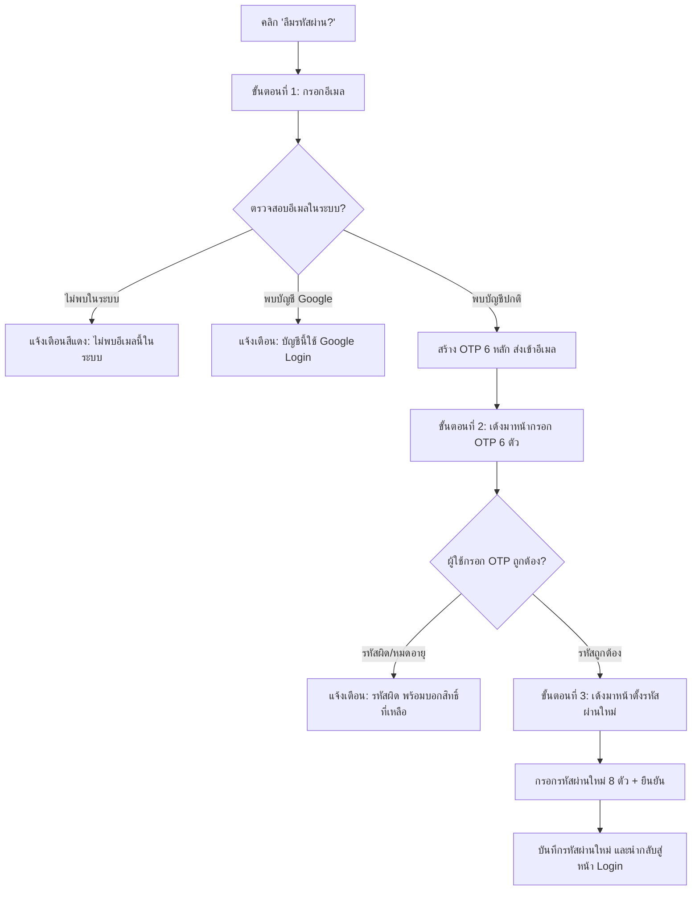

# ภาคผนวก ข

# คู่มือการใช้งานระบบ (User & Administrator Manual)
## โครงการ TradeSensei — ระบบสนับสนุนการวิเคราะห์และทำนายราคาหุ้นด้วยปัญญาประดิษฐ์
### (AI-Powered Stock Market Analysis & Forecasting Platform)

---

## สารบัญ

* [ข.1 บทนำและภาพรวมระบบ](#ข1-บทนำและภาพรวมระบบ)
  * [ข.1.1 วัตถุประสงค์ของคู่มือ](#ข11-วัตถุประสงค์ของคู่มือ)
  * [ข.1.2 สถาปัตยกรรมและเทคโนโลยีที่ใช้](#ข12-สถาปัตยกรรมและเทคโนโลยีที่ใช้)
  * [ข.1.3 ความต้องการของระบบ (System Requirements)](#ข13-ความต้องการของระบบ-system-requirements)
  * [ข.1.4 โครงสร้างสิทธิ์และบทบาทผู้ใช้งาน (User Roles & Permissions)](#ข14-โครงสร้างสิทธิ์และบทบาทผู้ใช้งาน-user-roles--permissions)
* [ข.2 คู่มือการจัดการบัญชีผู้ใช้ (Account Management)](#ข2-คู่มือการจัดการบัญชีผู้ใช้-account-management)
  * [ข.2.1 การสมัครสมาชิกใหม่ (User Registration)](#ข21-การสมัครสมาชิกใหม่-user-registration)
  * [ข.2.2 การเข้าสู่ระบบ (User Login)](#ข22-การเข้าสู่ระบบ-user-login)
  * [ข.2.3 การเข้าสู่ระบบด้วย Google Sign-In และโหมด Demo](#ข23-การเข้าสู่ระบบด้วย-google-sign-in-และโหมด-demo)
  * [ข.2.4 การขอรหัสผ่านใหม่ผ่านระบบ OTP 3 ขั้นตอน (Password Reset via OTP)](#ข24-การขอรหัสผ่านใหม่ผ่านระบบ-otp-3-ขั้นตอน-password-reset-via-otp)
  * [ข.2.5 การเปลี่ยนรหัสผ่าน (Change Password)](#ข25-การเปลี่ยนรหัสผ่าน-change-password)
  * [ข.2.6 การออกจากระบบ (Logout)](#ข26-การออกจากระบบ-logout)
* [ข.3 คู่มือการใช้งานสำหรับสมาชิกและผู้ใช้ทั่วไป (User Manual)](#ข3-คู่มือการใช้งานสำหรับสมาชิกและผู้ใช้ทั่วไป-user-manual)
  * [ข.3.1 การสำรวจหน้าหลักและการนำทาง (Navigation & Research Flow)](#ข31-การสำรวจหน้าหลักและการนำทาง-navigation--research-flow)
  * [ข.3.2 การค้นหาและเลือกดูข้อมูลสินทรัพย์ (Asset Catalog)](#ข32-การค้นหาและเลือกดูข้อมูลสินทรัพย์-asset-catalog)
  * [ข.3.3 การใช้งานกราฟแท่งเทียนและเส้นแนวโน้ม (Interactive Candlestick & SMA)](#ข33-การใช้งานกราฟแท่งเทียนและเส้นแนวโน้ม-interactive-candlestick--sma)
  * [ข.3.4 การดูผลพยากรณ์ราคาล่วงหน้า 7 วันด้วย AI (Prophet 7-Day Forecast)](#ข34-การดูผลพยากรณ์ราคาล่วงหน้า-7-วันด้วย-ai-prophet-7-day-forecast)
  * [ข.3.5 การวิเคราะห์อารมณ์ข่าวสารการเงิน (News Sentiment Analysis)](#ข35-การวิเคราะห์อารมณ์ข่าวสารการเงิน-news-sentiment-analysis)
  * [ข.3.6 การสนทนากับผู้ช่วยอัจฉริยะ (Sensei Copilot AI)](#ข36-การสนทนากับผู้ช่วยอัจฉริยะ-sensei-copilot-ai)
  * [ข.3.7 การจำลองผลตอบแทนการลงทุน Time Machine (Investment Simulation)](#ข37-การจำลองผลตอบแทนการลงทุน-time-machine-investment-simulation)
* [ข.4 คู่มือสำหรับผู้ดูแลระบบ (Administrator Manual)](#ข4-คู่มือสำหรับผู้ดูแลระบบ-administrator-manual)
  * [ข.4.1 การเข้าสู่ระบบผู้ดูแลระบบ (Admin Console)](#ข41-การเข้าสู่ระบบผู้ดูแลระบบ-admin-console)
  * [ข.4.2 การจัดการรายการหุ้นและสินทรัพย์ (Stock Management)](#ข42-การจัดการรายการหุ้นและสินทรัพย์-stock-management)
  * [ข.4.3 การสั่งประมวลผลดึงข้อมูลและฝึกสอนโมเดล AI (Task Dispatcher)](#ข43-การสั่งประมวลผลดึงข้อมูลและฝึกสอนโมเดล-ai-task-dispatcher)
  * [ข.4.4 การจัดการบัญชีผู้ใช้งาน (User Management)](#ข44-การจัดการบัญชีผู้ใช้งาน-user-management)
  * [ข.4.5 การตรวจสอบบันทึกการทำงานของระบบ (System Audit Logs)](#ข45-การตรวจสอบบันทึกการทำงานของระบบ-system-audit-logs)
* [ข.5 การแก้ไขปัญหาเบื้องต้นและคำถามที่พบบ่อย (Troubleshooting & FAQ)](#ข5-การแก้ไขปัญหาเบื้องต้นและคำถามที่พบบ่อย-troubleshooting--faq)

---

## ข.1 บทนำและภาพรวมระบบ

### ข.1.1 วัตถุประสงค์ของคู่มือ
คู่มือฉบับนี้จัดทำขึ้นเพื่อเป็นเอกสารประกอบรายงานโครงงาน / ปริญญานิพนธ์ (ภาคผนวก ข) โดยอธิบายขั้นตอนการทำงาน ส่วนต่อประสานกับผู้ใช้ (User Interface) และแนวทางการใช้งานระบบ **TradeSensei** ทั้งในมุมมองของผู้ใช้งานทั่วไป (Guest), สมาชิก (Member) และผู้ดูแลระบบ (Administrator) เพื่อให้สามารถใช้งานระบบได้อย่างถูกต้อง ปลอดภัย และเต็มประสิทธิภาพตามขอบเขตของโครงการ

### ข.1.2 สถาปัตยกรรมและเทคโนโลยีที่ใช้
ระบบ TradeSensei ได้รับการพัฒนาภายใต้สถาปัตยกรรมแยกส่วน (Decoupled Client-Server Architecture):
* **ส่วนหน้าเว็บ (Frontend):** พัฒนาด้วย HTML5, Vanilla JavaScript (ES6+), Vanilla CSS (Custom Design System ไม่ใช้ Framework สำเร็จรูป) และ Plotly.js สำหรับแสดงผลกราฟปฏิสัมพันธ์เชิงลึก
* **ส่วนประมวลผลหลังบ้าน (Backend API):** พัฒนาด้วยภาษา Python บนเฟรมเวิร์ก Flask RESTful API, Flask-JWT-Extended สำหรับยืนยันตัวตน, APScheduler สำหรับตั้งเวลางาน และ Flask-Limiter สำหรับป้องกัน Brute Force / DDoS
* **ฐานข้อมูล (Database):** PostgreSQL 15 ผ่าน SQLAlchemy ORM
* **โมเดลปัญญาประดิษฐ์ (AI & Machine Learning):**
  * **Time-Series Forecasting:** Facebook Prophet (GAM Piecewise Linear Trend with Multiplicative Seasonality)
  * **NLP Sentiment Analysis:** TextBlob Lexicon-Based NLP คำนวณคะแนน Polarity Score (-1 ถึง +1)
  * **Human-Friendly Copilot:** Google Gemini 2.5/1.5 Flash ผสานสถาปัตยกรรม Grounded RAG (Retrieval-Augmented Generation)

### ข.1.3 ความต้องการของระบบ (System Requirements)

**ตารางที่ ข.1 ความต้องการของระบบ (System Requirements)**

| องค์ประกอบ | ข้อกำหนดขั้นต่ำที่แนะนำ |
|---|---|
| **อุปกรณ์ใช้งาน (Client)** | คอมพิวเตอร์ตั้งโต๊ะ, แล็ปท็อป หรือแท็บเล็ต |
| **เว็บเบราว์เซอร์** | Google Chrome (v100 ขึ้นไป), Microsoft Edge, Mozilla Firefox, Safari |
| **การเชื่อมต่อเครือข่าย** | เครือข่ายอินเทอร์เน็ตความเร็ว 10 Mbps ขึ้นไป |
| **ความละเอียดหน้าจอ** | 1366 × 768 พิกเซลขึ้นไป (แนะนำ 1920 × 1080 พิกเซล) |

### ข.1.4 โครงสร้างสิทธิ์และบทบาทผู้ใช้งาน (User Roles & Permissions)
ระบบแบ่งสิทธิ์การเข้าถึงข้อมูลและการทำงานออกเป็น 3 ระดับ:

**ตารางที่ ข.2 โครงสร้างสิทธิ์และบทบาทผู้ใช้งาน (User Roles & Permissions)**

| ฟังก์ชันการทำงาน | ผู้ใช้ทั่วไป (Guest) | สมาชิก (Member) | ผู้ดูแลระบบ (Admin) |
|---|:---:|:---:|:---:|
| เข้าชมหน้าหลัก (Landing Page) | ✅ | ✅ | ✅ |
| ค้นหาและดูรายชื่อหุ้น 29 สินทรัพย์ | ✅ | ✅ | ✅ |
| ดูกราฟราคาแท่งเทียน (1D ถึง 2Y) และ SMA | ✅ | ✅ | ✅ |
| อ่านพาดหัวข่าวการเงินล่าสุด | ✅ | ✅ | ✅ |
| ดูผลทำนายราคาหุ้น 7 วันล่วงหน้า (AI Forecast) | ❌ | ✅ | ✅ |
| ดูบทวิเคราะห์เจาะลึกและคะแนนอารมณ์ข่าว | ❌ | ✅ | ✅ |
| สนทนากับ Sensei Copilot (AI Chatbot) | ❌ | ✅ | ✅ |
| ใช้งานแบบจำลอง Time Machine | ❌ | ✅ | ✅ |
| เปลี่ยนรหัสผ่านส่วนตัว | ❌ | ✅ | ✅ |
| เข้าสู่ระบบจัดการ Admin Console | ❌ | ❌ | ✅ |
| เพิ่ม / ลบ ข้อมูลหุ้นในระบบ | ❌ | ❌ | ✅ |
| สั่งดึงข้อมูลตลาด (Scraper) & เทรนโมเดล AI | ❌ | ❌ | ✅ |
| จัดการสิทธิ์และระงับบัญชีผู้ใช้งาน | ❌ | ❌ | ✅ |
| ตรวจสอบบันทึกความปลอดภัย (Audit Logs) | ❌ | ❌ | ✅ |

---

## ข.2 คู่มือการจัดการบัญชีผู้ใช้ (Account Management)

### ข.2.1 การสมัครสมาชิกใหม่ (User Registration)
สำหรับผู้ใช้งานที่ยังไม่มีบัญชีในระบบ สามารถสร้างบัญชีใหม่เพื่อเข้าถึงฟีเจอร์สำหรับสมาชิกได้ฟรี

> **ภาพประกอบที่ ข.1** หน้าต่างแบบฟอร์มสมัครสมาชิก (register.html)  
> *[แทรกภาพหน้าจอ register.html]*

#### ขั้นตอนการสมัครสมาชิก:
1. เข้าไปที่หน้าแรกของระบบ แล้วคลิกปุ่ม **"สมัครฟรี"** (มุมขวาบน) หรือเปิด URL `register.html`
2. กรอกข้อมูลในแบบฟอร์มให้ครบถ้วน:
   * **ชื่อจริง (First Name):** กรอกชื่อจริงภาษาไทยหรืออังกฤษ (จำเป็น)
   * **นามสกุล (Last Name):** กรอกนามสกุล (ไม่บังคับ)
   * **อีเมล (Email):** กรอกที่อยู่อีเมลที่ถูกต้องและใช้งานได้จริง
   * **รหัสผ่าน (Password):** กำหนดรหัสผ่านตามเงื่อนไขความปลอดภัย (ความยาวอย่างน้อย 8 ตัวอักษร และต้องประกอบด้วยตัวเลขอย่างน้อย 1 ตัว)
   * **ยืนยันรหัสผ่าน (Confirm Password):** กรอกรหัสผ่านซ้ำอีกครั้งให้ตรงกัน
3. คลิกปุ่ม **"สมัครสมาชิก"**
4. ระบบจะทำการตรวจสอบความถูกต้อง บันทึกข้อมูลลงฐานข้อมูล และเข้าสู่ระบบให้โดยอัตโนมัติ

---

### ข.2.2 การเข้าสู่ระบบ (User Login)
ผู้ใช้งานที่ลงทะเบียนแล้วสามารถเข้าสู่ระบบเพื่อใช้งานพื้นที่ทำงาน TradeSensei ได้ทันที

> **ภาพประกอบที่ ข.2** หน้าต่างเข้าสู่ระบบ (login.html)  
> *[แทรกภาพหน้าจอ login.html]*

#### ขั้นตอนการเข้าสู่ระบบ:
1. คลิกปุ่ม **"เข้าสู่ระบบ"** ที่แถบเมนูด้านบน หรือเปิด URL `login.html`
2. กรอก **อีเมล** และ **รหัสผ่าน** ที่ได้ลงทะเบียนไว้
3. คลิกปุ่ม **"เข้าสู่ระบบ"**
4. หากข้อมูลถูกต้อง ระบบจะนำท่านกลับไปยังหน้าหลัก พร้อมสิทธิ์การเข้าถึงข้อมูลระดับสมาชิก (ป้ายสถานะด้านบนจะแสดงข้อความว่า **"สมาชิก"**)

---

### ข.2.3 การเข้าสู่ระบบด้วย Google Sign-In และโหมด Demo
เพื่อความสะดวกรวดเร็วในการเข้าใช้งาน ระบบรองรับการยืนยันตัวตนทางเลือก:
* **ลงชื่อเข้าใช้ด้วย Google (Google Sign-In):**
  * คลิกปุ่ม **"ลงชื่อเข้าใช้ด้วย Google"**
  * เลือกบัญชี Google Account ที่ต้องการยืนยันตัวตน
  * ระบบจะดึงชื่อ นามสกุล และอีเมลมาสร้างบัญชีหรือเข้าสู่ระบบให้อัตโนมัติโดยไม่ต้องจำรหัสผ่าน
  *(หมายเหตุ: ต้องใช้งานผ่านโดเมน HTTPS หรือ localhost ที่ลงทะเบียน Authorized JavaScript Origins ใน Google Cloud Platform แล้ว)*
* **โหมดทดลองใช้งาน (Demo Member):**
  * เหมาะสำหรับการทดสอบฟังก์ชันในกรณีไม่มีบัญชีจริง
  * คลิกปุ่ม **"ทดลองเข้าสู่ระบบ Demo Member ทันที"**
  * ระบบจะกรอกอีเมล `member@example.com` และรหัสผ่านทดสอบให้โดยอัตโนมัติ พร้อมเข้าสู่ระบบทันที

---

### ข.2.4 การขอรหัสผ่านใหม่ผ่านระบบ OTP 3 ขั้นตอน (Password Reset via OTP)
กรณีที่สมาชิกลืมรหัสผ่าน ระบบมีกลไกการกู้คืนรหัสผ่านความปลอดภัยสูงผ่าน OTP (One-Time Password) 6 หลัก ทางอีเมล โดยแบ่งเป็น 3 ลำดับขั้นตอนที่ชัดเจน:

> **ภาพประกอบที่ ข.3** หน้าต่างขอรีเซ็ตรหัสผ่านและยืนยัน OTP 6 หลัก  
> *[แทรกภาพขั้นตอนการกรอก OTP 3 สเต็ป]*

#### รายละเอียดการทำงานทีละขั้นตอน:
* **ขั้นตอนที่ 1 (กรอกอีเมล):**
  1. คลิกข้อความ **"ลืมรหัสผ่าน?"** ใต้ฟอร์มล็อกอิน
  2. กรอกอีเมลของคุณลงในช่อง
  3. คลิกปุ่ม **"ส่งรหัส OTP"**
  4. ระบบจะค้นหาในฐานข้อมูลทันที:
     * หาก **ไม่พบอีเมล:** ระบบจะแสดงข้อความเตือนสีแดงว่า *"ไม่พบอีเมลนี้ในระบบ กรุณาตรวจสอบอีเมลหรือสมัครสมาชิก"* และไม่ยอมให้ไปขั้นตอนถัดไป
     * หาก **พบอีเมล:** ระบบจะส่งรหัส OTP 6 หลักไปยังอีเมล พร้อมเปลี่ยนหน้าไปยังขั้นตอนที่ 2 ทันที
* **ขั้นตอนที่ 2 (กรอกรหัส OTP 6 หลัก):**
  1. หน้าจอจะเปลี่ยนเป็นช่องกรอกรหัสตัวเลขขนาดใหญ่ 6 หลัก
  2. เปิดกล่องจดหมายอีเมลของคุณ เพื่อนำรหัส 6 หลัก (มีอายุใช้งาน 10 นาที) มากรอกลงในช่อง
  3. คลิกปุ่ม **"ยืนยันรหัส OTP"**
  4. หากกรอกรหัสผิด ระบบจะแสดงจำนวนครั้งที่เหลือ (กรอกผิดได้ไม่เกิน 5 ครั้งเพื่อป้องกันการเดาสุ่ม)
  5. หากกรอกถูกต้อง ระบบจะอนุญาตให้เข้าสู่ขั้นตอนที่ 3 ทันที
* **ขั้นตอนที่ 3 (ตั้งรหัสผ่านใหม่):**
  1. หน้าจอจะปรากฏช่อง **"รหัสผ่านใหม่"** และ **"ยืนยันรหัสผ่านใหม่"**
  2. กำหนดรหัสผ่านใหม่ความยาวอย่างน้อย 8 ตัวอักษรพร้อมตัวเลข
  3. คลิกปุ่ม **"บันทึกรหัสผ่านใหม่"**
  4. ระบบจะทำการแฮชรหัสผ่านด้วยอัลกอริทึม `scrypt` และยกเลิกสิทธิ์รหัส OTP เดิมทันที พร้อมนำผู้ใช้กลับสู่หน้าเข้าสู่ระบบ

---

### ข.2.5 การเปลี่ยนรหัสผ่าน (Change Password)
เมื่อสมาชิกเข้าสู่ระบบอยู่แล้ว และต้องการเปลี่ยนรหัสผ่านเพื่อความปลอดภัย:
1. คลิกปุ่ม **"เปลี่ยนรหัสผ่าน"** ที่แถบเมนูด้านบน
2. หน้าต่าง Modal จะปรากฏขึ้น ให้กรอก:
   * รหัสผ่านปัจจุบัน (Current Password)
   * รหัสผ่านใหม่ (New Password)
   * ยืนยันรหัสผ่านใหม่ (Confirm New Password)
3. คลิกปุ่ม **"บันทึก"**
4. ระบบจะทำการตรวจสอบรหัสเดิมและอัปเดตรหัสผ่านใหม่ลงสู่ฐานข้อมูล

---

### ข.2.6 การออกจากระบบ (Logout)
1. เมื่อเข้าสู่ระบบอยู่ ปุ่มบนแถบนำทางจะเปลี่ยนเป็น **"ออกจากระบบ"**
2. คลิกปุ่ม **"ออกจากระบบ"**
3. ระบบจะทำการล้าง Access Token และข้อมูลเซสชันใน LocalStorage ทั้งหมด และปรับสถานะหน้าเว็บกลับสู่โหมดผู้ใช้ทั่วไป (Guest Mode)

---

## ข.3 คู่มือการใช้งานสำหรับสมาชิกและผู้ใช้ทั่วไป (User Manual)

### ข.3.1 การสำรวจหน้าหลักและการนำทาง (Navigation & Research Flow)
หน้าหลักของระบบ TradeSensei ได้รับการออกแบบตามแนวคิด **Research-Driven Workflow** ช่วยแนะนำผู้ใช้งานในการศึกษาข้อมูลอย่างเป็นขั้นตอน

> **ภาพประกอบที่ ข.4** หน้าหลักและขั้นตอนการศึกษาข้อมูลตลาด (Research Flow)  
> *[แทรกภาพส่วน Hero และ Research Steps 01, 02, 03]*

* **ขั้นตอน 01 (เลือกสินทรัพย์):** ค้นหาหุ้นหรือเหรียญคริปโทฯ ที่ต้องการ
* **ขั้นตอน 02 (อ่านบริบทตลาด):** ดูกราฟราคาแท่งเทียน ข่าว และอารมณ์ตลาด
* **ขั้นตอน 03 (วิเคราะห์เชิงลึก):** ใช้เครื่องมือ AI Forecast, Backtest และคุยกับ Copilot

---

### ข.3.2 การค้นหาและเลือกดูข้อมูลสินทรัพย์ (Asset Catalog)
ระบบมีแคตตาล็อกสินทรัพย์ให้เลือกรวม 29 รายการ ครอบคลุม 3 กลุ่มหลัก:

> **ภาพประกอบที่ ข.5** แถบเลือกสินทรัพย์และตัวกรองหมวดหมู่  
> *[แทรกภาพเมนู Dropdown หุ้นและแท็บหมวดหมู่]*

1. **หุ้นไทยชั้นนำ (SET50):** PTT, AOT, DELTA, ADVANC, CPALL, KBANK, SCB, BDMS, GULF, SCC, TRUE, MINT, PTTEP, BBL, CPN, BH
2. **หุ้นเทคโนโลยีระดับโลก (Global Tech):** AAPL, MSFT, TSLA, NVDA, GOOGL, AMZN, META, AMD, NFLX
3. **คริปโทเคอร์เรนซี (Cryptocurrency):** BTC-USD, ETH-USD, SOL-USD, BNB-USD

#### วิธีการใช้งาน:
* พิมพ์ชื่อย่อหรือชื่อบริษัทในช่อง **"ค้นหาชื่อย่อหุ้น..."**
* หรือคลิกเลือกหมวดหมู่ที่ต้องการ (เช่น หมวดเทคโนโลยี, พลังงาน, สถาบันการเงิน, คริปโท)
* คลิกที่แถวของสินทรัพย์นั้นๆ ระบบจะทำการโหลดข้อมูลราคาย้อนหลังและข่าวสารขึ้นมาแสดงทันที

---

### ข.3.3 การใช้งานกราฟแท่งเทียนและเส้นแนวโน้ม (Interactive Candlestick & SMA)
ระบบใช้ Plotly.js ในการวาดกราฟปฏิสัมพันธ์ที่คมชัด แม่นยำ และตอบสนองต่อผู้ใช้

> **ภาพประกอบที่ ข.6** กราฟแท่งเทียน OHLCV พร้อมเส้น SMA 20 และ SMA 50  
> *[แทรกภาพกราฟแท่งเทียน]*

#### องค์ประกอบของกราฟ:
1. **แท่งเทียน (Candlestick):** แสดงราคาเปิด (Open), สูงสุด (High), ต่ำสุด (Low), และปิด (Close)
   * แท่งสีเขียว: ราคาปิดสูงกว่าราคาเปิด (Bullish)
   * แท่งสีแดง: ราคาปิดต่ำกว่าราคาเปิด (Bearish)
2. **เส้นค่าเฉลี่ยเคลื่อนที่ (Moving Averages):**
   * **เส้น SMA 20 (สีส้ม):** เส้นแนวโน้มราคาเฉลี่ยระยะสั้น 20 วัน
   * **เส้น SMA 50 (สีฟ้า):** เส้นแนวโน้มราคาเฉลี่ยระยะกลาง 50 วัน
3. **ปริมาณการซื้อขาย (Volume Bar):** แถบแสดงวอลุ่มการซื้อขายที่ด้านล่างกราฟ
4. **ปุ่มเลือกช่วงเวลา (Timeframe Selectors):**
   * `1D`: ข้อมูลราคาราย 1 วัน (Intraday)
   * `7D`: ข้อมูลราคาราย 7 วัน
   * `1M`: ข้อมูลย้อนหลัง 1 เดือน
   * `6M`: ข้อมูลย้อนหลัง 6 เดือน
   * `1Y`: ข้อมูลย้อนหลัง 1 ปี
   * `2Y`: ข้อมูลย้อนหลัง 2 ปี
5. **การควบคุมกราฟ:** สามารถเลื่อนเมาส์ชี้เพื่อดูค่าตัวเลข, คลิกและลากเพื่อขยาย (Zoom-in), หรือดับเบิลคลิกเพื่อรีเซ็ตขนาดกราฟ

---

### ข.3.4 การดูผลพยากรณ์ราคาล่วงหน้า 7 วันด้วย AI (Prophet 7-Day Forecast)
*(ฟีเจอร์สำหรับสมาชิก)* โมเดลปัญญาประดิษฐ์ Prophet จะทำการคำนวณแนวโน้มราคาและพยากรณ์ราคาปิดล่วงหน้า 7 วันทำการ

> **ภาพประกอบที่ ข.7** เส้นพยากรณ์ราคาและแถบความเชื่อมั่น 90% (Forecast Band)  
> *[แทรกภาพเส้นพยากรณ์ราคา AI]*

#### วิธีการเปิดใช้งาน:
1. คลิกปุ่ม **"Forecast 7 วัน"** ที่อยู่เหนือพื้นที่กราฟ
2. กราฟจะแสดงเส้นประสีฟ้าพยากรณ์ต่อไปข้างหน้าอีก 7 วัน พร้อมแถบเงาสีฟ้าโปร่งแสง
3. **แถบความเชื่อมั่น 90% (Confidence Interval):**
   * ขอบบน (Upper Bound): ราคาสูงสุดที่คาดว่าจะเป็นไปได้ภายใต้ความเชื่อมั่น 90%
   * ขอบล่าง (Lower Bound): ราคาต่ำสุดที่คาดว่าจะเป็นไปได้ภายใต้ความเชื่อมั่น 90%
4. **ค่าความแม่นยำ (Hold-out Accuracy %):** ระบบจะแสดงตัวเลขเปอร์เซ็นต์ความแม่นยำจากการทดสอบย้อนหลัง เพื่อช่วยให้สมาชิกประเมินความน่าเชื่อถือของโมเดลได้ด้วยตนเอง

---

### ข.3.5 การวิเคราะห์อารมณ์ข่าวสารการเงิน (News Sentiment Analysis)
ระบบรวบรวมข่าวสารการเงินล่าสุดที่เกี่ยวข้องกับสินทรัพย์ที่เลือก พร้อมส่งต่อให้โมเดล NLP ทำการวิเคราะห์ทัศนคติของข่าว

> **ภาพประกอบที่ ข.8** กล่องสรุปผลวิเคราะห์อารมณ์ข่าวและการกระจายตัวบวก/ลบ  
> *[แทรกภาพ Sentiment Card]*

#### ข้อมูลที่แสดงผล:
* **Polarity Score (-1.0 ถึง +1.0):**
  * ค่าบวก (> +0.05): ข่าวสารโดยรวมมีทิศทาง **เชิงบวก (Positive)** สนับสนุนการเติบโต
  * ค่าใกล้ศูนย์ (-0.05 ถึง +0.05): ข่าวสารโดยรวมมีทิศทาง **เป็นกลาง (Neutral)**
  * ค่าลบ (< -0.05): ข่าวสารโดยรวมมีทิศทาง **เชิงลบ (Negative)** ควรระมัดระวัง
* **สัดส่วนข่าว (Positive vs Negative Ratio):** แสดงเป็นเปอร์เซ็นต์ของจำนวนข่าวดีและข่าวลบ
* **รายการข่าวล่าสุด:** สมาชิกสามารถคลิกอ่านหัวข้อข่าวและคลิกลิงก์เพื่อเปิดอ่านบทความต้นฉบับได้

---

### ข.3.6 การสนทนากับผู้ช่วยอัจฉริยะ (Sensei Copilot AI)
*(ฟีเจอร์สำหรับสมาชิก)* ผู้ช่วยวิเคราะห์การลงทุนที่ขับเคลื่อนด้วย Google Gemini ผสานข้อมูลตลาดสด (RAG) พร้อมสนทนาด้วยสำนวนอบอุ่น เป็นมิตร และให้ข้อมูลเชิงสถิติที่ตรงไปตรงมา

> **ภาพประกอบที่ ข.9** หน้าต่างสนทนากับ Sensei Copilot (RAG Chatbot)  
> *[แทรกภาพหน้าต่างแชท Copilot]*

#### วิธีการใช้งาน:
1. คลิกปุ่ม **"Ask Sensei Copilot"** หรือเปิดเมนูด้านข้าง
2. หน้าต่างแชทจะเปิดขึ้นพร้อมข้อความทักทายและคำถามแนะนำ เช่น:
   * *"แนวโน้มราคา PTT ในอีก 7 วันข้างหน้าเป็นอย่างไร?"*
   * *"สรุปข่าวล่าสุดและอารมณ์ตลาดของสินทรัพย์นี้ให้ฟังหน่อย"*
   * *"ค่าความแม่นยำของโมเดลพยากรณ์ตัวนี้อยู่ที่เท่าไหร่?"*
3. พิมพ์คำถามลงในช่องแชท แล้วคลิกปุ่ม **"ส่ง"** (หรือกด `Enter`)
4. AI จะประมวลผลข้อมูลราคาจริง กราฟเทคนิค และข่าวสารในระบบ เพื่อสรุปคำตอบให้เข้าใจง่าย:
   * **ข้อความไฮไลท์สีเขียว:** แสดงสัญญาณบวก ปัจจัยสนับสนุน หรือคำแนะนำเชิงบวก
   * **ข้อความไฮไลท์สีแดง:** แสดงจุดสังเกต สัญญาณเตือน หรือความเสี่ยงที่ต้องระวัง
5. **การล้างประวัติการสนทนา:** สามารถคลิกไอคอนรูปถังขยะ **"ลบประวัติ"** เพื่อเริ่มต้นการสนทนาใหม่ได้ตลอดเวลา

---

### ข.3.7 การจำลองผลตอบแทนการลงทุน Time Machine (Investment Simulation)
เครื่องมือศึกษาพฤติกรรมผลตอบแทนในอดีต เปรียบเทียบผลจากการถือครองหุ้นกับการฝากเงินในธนาคาร

> **ภาพประกอบที่ ข.10** หน้าต่างจำลองผลตอบแทน Time Machine  
> *[แทรกภาพผลการคำนวณ Time Machine]*

#### ขั้นตอนการจำลอง:
1. คลิกปุ่ม **"Time Machine"**
2. ระบุข้อมูลที่ต้องการทดสอบ:
   * **เงินลงทุนเริ่มต้น (บาท):** เช่น `100,000` บาท (ขั้นต่ำ 1,000 บาท)
   * **ระยะเวลาย้อนหลัง (เดือน):** เลือกได้ตั้งแต่ `1` ถึง `24` เดือน
3. คลิกปุ่ม **"เริ่มจำลอง"**
4. ระบบจะแสดงการเปรียบเทียบผลลัพธ์:
   * **พอร์ตหุ้น:** มูลค่าเงินปัจจุบัน, กำไร/ขาดทุนสุทธิ (บาท) และอัตราผลตอบแทน (%)
   * **เงินฝากออมทรัพย์:** คำนวณดอกเบี้ยทบต้นตามอัตรามาตรฐาน 2.5% ต่อปี
   * แสดงบทสรุปเปรียบเทียบว่าการลงทุนแบบใดให้ผลตอบแทนคุ้มค่ากว่าในช่วงเวลาดังกล่าว

---

## ข.4 คู่มือสำหรับผู้ดูแลระบบ (Administrator Manual)

### ข.4.1 การเข้าสู่ระบบผู้ดูแลระบบ (Admin Console)
ผู้ใช้ที่มีสิทธิ์ระดับ `admin` สามารถเข้าถึงหน้าต่างควบคุมระบบได้โดยตรง:
1. เข้าสู่ระบบผ่าน `login.html` ด้วยบัญชีผู้ดูแลระบบ (ค่าเริ่มต้นของระบบคือ `admin@tradesensei.com`)
2. ระบบจะตรวจสอบ Role และนำทางมายังหน้า **`admin.html`** โดยอัตโนมัติ

> **ภาพประกอบที่ ข.11** แผงควบคุมระบบสำหรับผู้ดูแลระบบ (admin.html)  
> *[แทรกภาพ Admin Dashboard]*

---

### ข.4.2 การจัดการรายการหุ้นและสินทรัพย์ (Stock Management)
ผู้ดูแลระบบสามารถควบคุมรายชื่อสินทรัพย์ที่เปิดให้สมาชิกเข้าดูและวิเคราะห์ในระบบ:

#### การเพิ่มหุ้นใหม่เข้าระบบ:
1. ในส่วน **"เพิ่มหุ้นใหม่ในระบบ"** ให้กรอก:
   * **ชื่อย่อหุ้น (Symbol):** เช่น `CPALL.BK`, `NVDA`, `BTC-USD` (ระบบจะแปลงเป็นตัวพิมพ์ใหญ่อัตโนมัติ)
   * **ชื่อบริษัท (Company Name):** เช่น `CP ALL Public Company Limited`
   * **หมวดหมู่ (Category):** เช่น `Consumer Staples`, `Technology`, `Crypto`
2. คลิกปุ่ม **"เพิ่มหุ้นเข้าระบบ"**
3. ระบบจะบันทึกหุ้นลงสู่ฐานข้อมูล Master Data ทันที

#### การลบหุ้นออกจากระบบ:
* ในตารางรายชื่อหุ้น ให้ค้นหาหุ้นที่ต้องการ แล้วคลิกปุ่ม **"ลบ"**
* ยืนยันการลบในกล่องข้อความเตือน ระบบจะลบข้อมูลหุ้น ราคา ข่าว และผลทำนายที่เกี่ยวข้องออกทั้งหมด (Cascading Delete)

---

### ข.4.3 การสั่งประมวลผลดึงข้อมูลและฝึกสอนโมเดล AI (Task Dispatcher)
เพื่อให้ข้อมูลราคาและโมเดลทำนายเป็นปัจจุบัน ผู้ดูแลระบบสามารถสั่งรันงานประมวลผลได้จากหน้าเว็บ:

> **ภาพประกอบที่ ข.12** ปุ่มสั่งประมวลผล Background Tasks ของผู้ดูแลระบบ  
> *[แทรกภาพปุ่ม Scraper และ Train Models]*

1. **ปุ่ม "ดึงข้อมูลตลาดล่าสุด (Scraper)":**
   * สั่งให้ระบบดึงราคาหุ้นล่าสุดย้อนหลัง 2 ปี และข่าวสารการเงินจากตลาดเข้าสู่ฐานข้อมูล
2. **ปุ่ม "เทรนโมเดลทำนาย (Prophet)":**
   * สั่งให้ระบบฝึกสอนโมเดล Prophet สำหรับหุ้นทุกตัวในระบบแบบเบื้องหลัง (Background Worker) เพื่อไม่ให้หน้าเว็บค้าง
3. **ปุ่ม "เทรนโมเดลแบบทันที (Sync)":**
   * เหมาะสำหรับการทดสอบโมเดลทีละขั้นตอน โดยระบบจะประมวลผลและส่งผลลัพธ์กลับมาแสดงทันที

---

### ข.4.4 การจัดการบัญชีผู้ใช้งาน (User Management)
ผู้ดูแลระบบสามารถตรวจสอบรายชื่อผู้ใช้งานทั้งหมดในระบบ ปรับเปลี่ยนสิทธิ์ และลบบัญชีที่ไม่พึงประสงค์:

> **ภาพประกอบที่ ข.13** ตารางจัดการผู้ใช้งานและหน้าต่างแก้ไขบทบาท  
> *[แทรกภาพตาราง Users]*

1. **ดูรายชื่อและค้นหา:** ตารางจะแสดง ID, ชื่อ-นามสกุล, อีเมล, ประเภทบัญชี (Google / ทั่วไป) และบทบาท (Role)
2. **แก้ไขบทบาท (Change Role):**
   * คลิกปุ่ม **"แก้ไข"** ที่แถวของผู้ใช้คนนั้น
   * เลือกบทบาทใหม่ระหว่าง `member` (สมาชิกทั่วไป) หรือ `admin` (ผู้ดูแลระบบ)
   * คลิกปุ่ม **"บันทึกการแก้ไข"**
3. **ลบผู้ใช้งาน (Delete User):**
   * คลิกปุ่ม **"ลบ"** เพื่อลบบัญชีผู้ใช้นั้นออกจากระบบ

---

### ข.4.5 การตรวจสอบบันทึกการทำงานของระบบ (System Audit Logs)
เพื่อความโปร่งใสและการตรวจสอบความปลอดภัยไซเบอร์ ระบบมีการบันทึกเหตุการณ์สำคัญ (System Logs) ไว้ในฐานข้อมูล:

> **ภาพประกอบที่ ข.14** ตารางบันทึกความปลอดภัยและประวัติการทำงานของระบบ  
> *[แทรกภาพ System Logs]*

* **ข้อมูลที่บันทึก:** เวลาเกิดเหตุการณ์ (Timestamp), รหัสผู้ใช้ (User ID), ประเภทกิจกรรม (Action Type) และรายละเอียด (Description)
* **ตัวอย่างกิจกรรมที่บันทึก:**
  * `AUTH_LOGIN_SUCCESS`: การเข้าสู่ระบบสำเร็จ
  * `AUTH_LOGIN_FAILED`: การพยายามเข้าสู่ระบบด้วยรหัสผ่านที่ไม่ถูกต้อง
  * `AUTH_PASSWORD_RESET_OTP_SENT`: การออกรหัส OTP ขอเปลี่ยนรหัสผ่าน
  * `ADMIN_RUN_SCRAPER`: การสั่งดึงข้อมูลตลาดโดยผู้ดูแลระบบ
  * `ADMIN_UPDATE_USER`: การเปลี่ยนสิทธิ์ผู้ใช้งาน
* ผู้ดูแลระบบสามารถคลิกปุ่ม **"รีเฟรชบันทึก"** หรือกรองดูเฉพาะกิจกรรมที่สนใจเพื่อตรวจสอบความปลอดภัยได้

---

## ข.5 การแก้ไขปัญหาเบื้องต้นและคำถามที่พบบ่อย (Troubleshooting & FAQ)

**ตารางที่ ข.3 การแก้ไขปัญหาเบื้องต้นและคำถามที่พบบ่อย (Troubleshooting & FAQ)**

| ปัญหาที่พบ | สาเหตุที่เป็นไปได้ | แนวทางแก้ไข |
|---|---|---|
| **หน้าเว็บขึ้นข้อความ "ไม่สามารถเชื่อมต่อ Backend ได้"** | เซิร์ฟเวอร์ Backend หรือ Docker ยังไม่ได้เปิดทำงาน หรือ `API_BASE` ชี้ผิดที่ | 1. ตรวจสอบว่าได้รัน `docker compose up -d` หรือเปิดพอร์ต 5000 แล้วหรือไม่ 2. หากรันข้ามเครื่อง ให้ตรวจสอบ URL ในไฟล์ `frontend/auth.js` ให้ตรงกับ URL สาธารณะ (เช่น Cloudflare Tunnel หรือ IP จริง) |
| **ล็อกอินด้วย Google แล้วขึ้นข้อความ `400: origin_mismatch`** | ที่อยู่เว็บที่เปิดอยู่ไม่ได้ลงทะเบียนใน Authorized JavaScript origins | ไปที่ Google Cloud Console -> เมนู Clients -> แก้ไข Web Client -> เพิ่ม URL ของเว็บที่คุณเปิด (เช่น `http://127.0.0.1:5500`) ลงในช่อง **Authorized JavaScript origins** แล้วบันทึก |
| **ล็อกอินด้วย Google แล้วขึ้นข้อความ `400: invalid_request`** | มีการเรียก Google OAuth ผ่านหมายเลข IP ดิบ หรือผ่าน HTTP ธรรมดา | Google บังคับให้ใช้ชื่อโดเมนและเป็น HTTPS เท่านั้น (ยกเว้น `localhost`) สำหรับการทดสอบบนเซิร์ฟเวอร์มหาลัย ให้ใช้วิธีล็อกอินด้วยอีเมลและรหัสผ่านธรรมดาแทน |
| **ขอรหัส OTP แล้วไม่ได้รับอีเมล** | 1. กรอกอีเมลไม่ตรงกับที่สมัครไว้ในระบบ 2. ส่งอีเมลผ่าน Resend ในโหมดทดสอบ (Sandbox) | 1. ตรวจสอบให้แน่ใจว่าได้สมัครสมาชิกด้วยอีเมลนั้นแล้ว 2. ตรวจสอบในกล่องจดหมายขยะ (Junk/Spam) 3. สำหรับผู้ดูแลระบบ สามารถเปิดดูรหัส OTP ล่าสุดได้จากตาราง **System Logs** ในหน้า Admin |
| **เปิดหน้าเว็บแล้วปุ่มกดไม่ทำงาน หรือหน้าตาผิดเพี้ยน** | เว็บเบราว์เซอร์จำไฟล์ JavaScript หรือ CSS เวอร์ชันเก่าไว้ (Browser Cache) | กดปุ่ม **`Ctrl` + `Shift` + `R`** (หรือ `Ctrl` + `F5`) บนคีย์บอร์ด เพื่อสั่งให้เบราว์เซอร์ล้างแคชและดาวน์โหลดไฟล์ใหม่ล่าสุด |
| **กราฟราคาหุ้นไม่โหลดขึ้นมา** | ข้อมูลราคาของหุ้นตัวนั้นยังไม่ถูกดึงเข้ามาในฐานข้อมูล | เข้าสู่ระบบด้วยบัญชี Admin แล้วคลิกปุ่ม **"ดึงข้อมูลตลาดล่าสุด (Scraper)"** 1 ครั้ง เพื่อให้ระบบดึงข้อมูลราคาหุ้นมาบันทึกในฐานข้อมูล |

---

*จัดทำขึ้นสำหรับเป็นเอกสารคู่มือการใช้งานระบบในเอกสารรายงานโครงงาน / ปริญญานิพนธ์ฉบับสมบูรณ์ (ภาคผนวก ข)*  
*โครงการพัฒนาระบบสนับสนุนการทำนายหุ้นด้วยปัญญาประดิษฐ์ TradeSensei*
