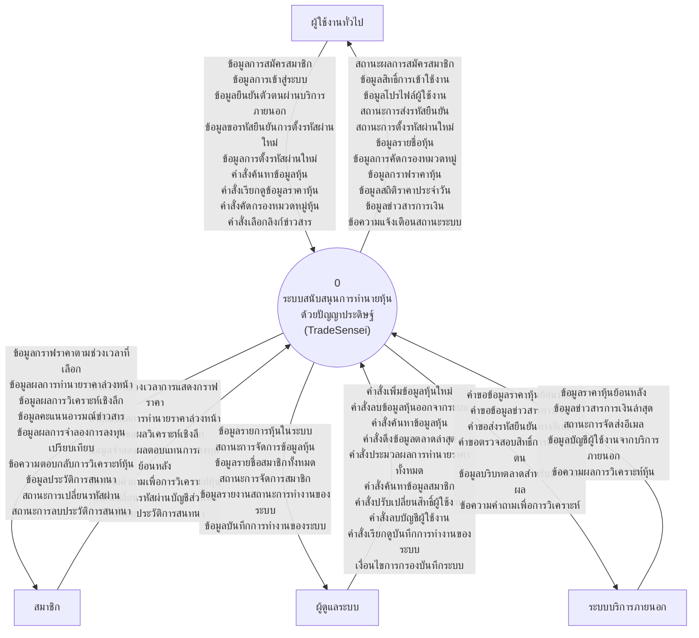
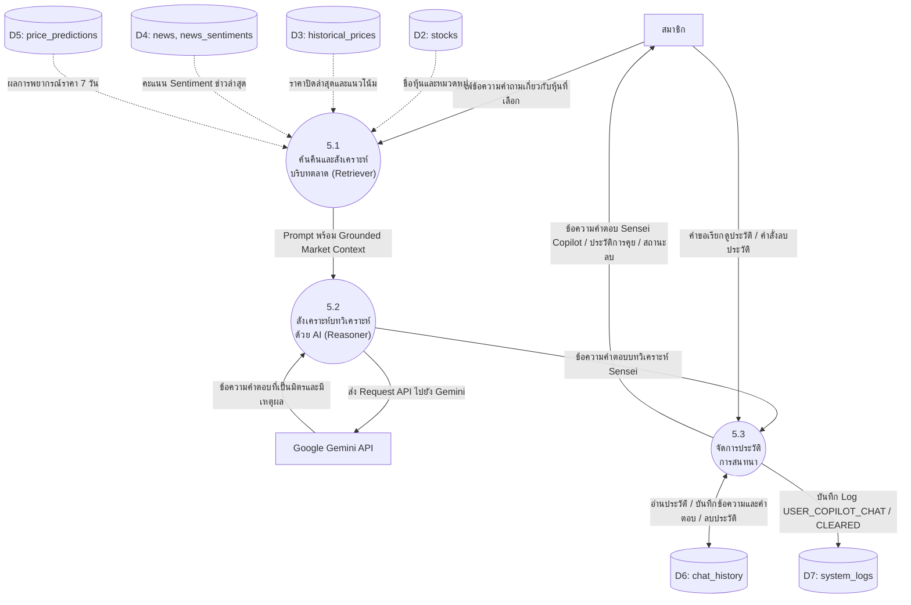

# เอกสารข้อกำหนดระบบ แผนภาพกระแสข้อมูล (DFD) และแผนภาพความสัมพันธ์เอนทิตี (ER Diagram)
## ระบบสนับสนุนการทำนายหุ้นด้วยปัญญาประดิษฐ์ (TradeSensei Platform)
**เวอร์ชันเอกสาร:** 3.0 (ฉบับพิมพ์เขียวใหม่ สมบูรณ์ ถูกต้อง ตรงตามระบบที่พัฒนาและใช้งานจริง 100%)  
**อ้างอิงจาก:** ซอร์สโค้ดระบบจริง Frontend (Vanilla JS / HTML / CSS), Backend API (Python Flask), Database Schema (`schema.py`), Backup SQL (`tradesensei_backup.sql`), โมเดลปัญญาประดิษฐ์ (Prophet, TextBlob, Gemini API) และบริการภายนอก (Yahoo Finance, Resend Email, Google Identity Services)

---

# สารบัญ
1. [ส่วนที่ 1: เอกสารขอบเขตของระบบ (System Scope of Work)](#ส่วนที่-1-เอกสารขอบเขตของระบบ-system-scope-of-work)
   - 1.1 วัตถุประสงค์และภาพรวมระบบ
   - 1.2 ขอบเขตด้านกลุ่มผู้ใช้งานและสิทธิ์การเข้าถึง (User Roles & Permissions)
   - 1.3 ขอบเขตด้านฟังก์ชันการทำงานของระบบ (Functional Requirements 7 ด้าน)
   - 1.4 ขอบเขตด้านข้อมูลและสินทรัพย์ทางการเงิน (Asset Coverage 29 รายการ)
   - 1.5 ขอบเขตด้านเทคโนโลยีและสถาปัตยกรรมระบบ (Technology Stack & Architecture)
   - 1.6 ขอบเขตด้านความปลอดภัยและการทดสอบ (Security & Testing Scope)
2. [ส่วนที่ 2: แผนภาพกระแสข้อมูล (Data Flow Diagram - DFD)](#ส่วนที่-2-แผนภาพกระแสข้อมูล-data-flow-diagram---dfd)
   - 2.1 สรุปเหตุผลและการปรับปรุงไดอะแกรมใหม่ให้สะท้อนระบบจริง (Real-World Re-engineering)
   - 2.2 Context Diagram (DFD Level 0) ฉบับสมบูรณ์ตรงกับระบบจริง 100%
   - 2.2.1 ตารางตรวจสอบความเข้ากันได้ของ DFD Level 0 กับซอร์สโค้ดระบบจริง (Codebase Verification & Mapping Table)
   - 2.3 DFD Level 1 ฉบับสมบูรณ์ (กระจาย 6 กระบวนการหลัก และ 7 คลังข้อมูล D1-D7)
   - 2.4 DFD Level 2: กระบวนการย่อย 1.0 (จัดการข้อมูลผู้ใช้งาน ยืนยันตัวตน และ OTP)
   - 2.5 DFD Level 2: กระบวนการย่อย 2.0 (จัดการข้อมูลหุ้นและการดึงข้อมูลตลาด Scraper)
   - 2.6 DFD Level 2: กระบวนการย่อย 3.0 (ประมวลผลโมเดลทำนาย Prophet และวิเคราะห์อารมณ์ข่าว)
   - 2.7 DFD Level 2: กระบวนการย่อย 4.0 (แสดงผลข้อมูลตลาด กราฟราคา และจำลองการลงทุน Time Machine)
   - 2.8 DFD Level 2: กระบวนการย่อย 5.0 (บริการที่ปรึกษาการลงทุน Sensei Copilot ด้วย RAG + Gemini)
   - 2.9 DFD Level 2: กระบวนการย่อย 6.0 (ตรวจสอบและจัดการบันทึกการทำงานของระบบ System Logs)
   - 2.10 พจนานุกรมข้อมูลกระแสข้อมูล (Data Flow Dictionary)
3. [ส่วนที่ 3: แผนภาพความสัมพันธ์เอนทิตี (ER Diagram & Data Dictionary)](#ส่วนที่-3-แผนภาพความสัมพันธ์เอนทิตี-er-diagram--data-dictionary)
   - 3.1 ผลการวิเคราะห์โครงสร้างฐานข้อมูลจริง 11 ตาราง (Gap Analysis)
   - 3.2 แผนภาพ ER Diagram (Crow's Foot Notation) ฉบับสมบูรณ์ 11 ตาราง
   - 3.3 พจนานุกรมข้อมูลฐานข้อมูล (Database Data Dictionary ครบทั้ง 11 ตาราง)
   - 3.4 กฎความคงสภาพและความสัมพันธ์ (Referential Integrity, Cascade Rules & Indexing)

---

# ส่วนที่ 1: เอกสารขอบเขตของระบบ (System Scope of Work)

### 1.1 วัตถุประสงค์และภาพรวมระบบ
ระบบ **TradeSensei** เป็นเว็บแอปพลิเคชันสนับสนุนการวิเคราะห์และทำนายราคาหุ้นด้วยปัญญาประดิษฐ์ (AI-Powered Stock Market Analysis & Forecasting Platform) พัฒนาขึ้นเพื่อช่วยให้นักลงทุนรายย่อยและบุคคลทั่วไปสามารถเข้าถึงข้อมูลสถิติราคา กราฟเทคนิค ผลการพยากรณ์ราคา 7 วันล่วงหน้า การประเมินคะแนนอารมณ์ข่าวสารการเงิน การจำลองผลตอบแทนย้อนหลัง และการปรึกษาวิเคราะห์หุ้นกับปัญญาประดิษฐ์ (Sensei Copilot) ได้อย่างสะดวก รวดเร็ว แม่นยำ และมีความปลอดภัยสูงตามมาตรฐานสากล

---

### 1.2 ขอบเขตด้านกลุ่มผู้ใช้งานและสิทธิ์การเข้าถึง (User Roles & Permissions)
ระบบจำแนกกลุ่มผู้ใช้งานและสิทธิ์ในการเข้าถึงฟังก์ชันต่างๆ ออกเป็น 3 กลุ่มตามการทำงานจริงของระบบ:

| ฟังก์ชันการทำงานของระบบ | ผู้ใช้งานทั่วไป (Guest) | สมาชิก (Member) | ผู้ดูแลระบบ (Admin) |
|---|:---:|:---:|:---:|
| 1. เข้าชมหน้าเว็บหลักและภาพรวมการใช้งาน | ✅ | ✅ | ✅ |
| 2. ค้นหา ดูรายชื่อ และกรองหมวดหมู่สินทรัพย์ (29 รายการ) | ✅ | ✅ | ✅ |
| 3. ดูกราฟแท่งเทียน Candlestick และเส้นค่าเฉลี่ยเคลื่อนที่ SMA 20 / SMA 50 | ✅ | ✅ | ✅ |
| 4. เลือกช่วงเวลากราฟราคา (1D, 7D, 1M, 6M, 1Y, 2Y) | ❌ (ล็อกค่าเริ่มต้น 1Y เท่านั้น) | ✅ | ✅ |
| 5. อ่านข่าวสารการเงินล่าสุดและเปิดลิงก์ไปยังสำนักข่าวต้นทาง | ✅ | ✅ | ✅ |
| 6. สมัครสมาชิกใหม่ (Register) ด้วยอีเมลและรหัสผ่าน | ✅ | — | — |
| 7. เข้าสู่ระบบด้วย Email/Password หรือโหมด Demo | ✅ | — | — |
| 8. เข้าสู่ระบบด้วยบัญชี Google (Google Sign-In via GIS) | ✅ | — | — |
| 9. ขอรหัส OTP ทางอีเมลเพื่อกู้คืนรหัสผ่าน (Forgot Password via Resend) | ✅ | — | — |
| 10. ยืนยันรหัส OTP 6 หลักและตั้งรหัสผ่านใหม่ (Reset Password) | ✅ | — | — |
| 11. ดูผลทำนายราคาหุ้น 7 วันล่วงหน้า (AI Prophet Forecast) พร้อมกรอบ CI 90% | ❌ | ✅ | ✅ |
| 12. ดูผลวิเคราะห์เจาะลึกและคะแนนอารมณ์ข่าว (Sentiment Analysis Polarity & Label) | ❌ | ✅ | ✅ |
| 13. จำลองผลตอบแทนการลงทุนย้อนหลังเทียบเงินฝาก (Time Machine Backtest) | ❌ | ✅ | ✅ |
| 14. สนทนาวิเคราะห์หุ้นกับผู้ช่วยอัจฉริยะ (Sensei Copilot RAG + Gemini) | ❌ | ✅ | ✅ |
| 15. ลบประวัติการสนทนาของตนเอง (Clear Chat History) | ❌ | ✅ | ✅ |
| 16. เปลี่ยนรหัสผ่านบัญชีส่วนตัว (Change Password) | ❌ | ✅ | ✅ |
| 17. ออกจากระบบ (Logout) | ❌ | ✅ | ✅ |
| 18. เข้าถึงศูนย์ควบคุมผู้ดูแลระบบ (Admin Console: `admin.html`) | ❌ | ❌ | ✅ |
| 19. เพิ่มข้อมูลหุ้นใหม่เข้าสู่ระบบ (Add Stock) พร้อมดึงข้อมูลตั้งต้น | ❌ | ❌ | ✅ |
| 20. ลบข้อมูลหุ้นออกจากระบบ (Delete Stock with CASCADE) | ❌ | ❌ | ✅ |
| 21. สั่งเริ่มการดึงข้อมูลราคาและข่าวล่าสุดทันที (Trigger Market Scraper) | ❌ | ❌ | ✅ |
| 22. สั่งประมวลผลเทรนโมเดลทำนาย Prophet ให้กับหุ้นทุกตัว (Batch Train Models) | ❌ | ❌ | ✅ |
| 23. บริหารจัดการบัญชีผู้ใช้งาน (ดูรายชื่อ, ปรับสิทธิ์ Member/Admin, ลบบัญชี) | ❌ | ❌ | ✅ |
| 24. เรียกดูและกรองบันทึกความปลอดภัยและการทำงานของระบบ (Audit System Logs) | ❌ | ❌ | ✅ |

---

### 1.3 ขอบเขตด้านฟังก์ชันการทำงานของระบบ (Functional Requirements 7 ด้าน)

1. **ระบบจัดการบัญชีผู้ใช้งาน การยืนยันตัวตน และการกู้คืนรหัสผ่าน (Identity & Access Management):**
   - การลงทะเบียนด้วยชื่อ นามสกุล อีเมล และรหัสผ่านที่ปลอดภัย (เข้ารหัสแฮชด้วยอัลกอริทึม `scrypt`)
   - การเข้าสู่ระบบด้วยรหัสผ่าน, บัญชีทดลองระบบ (Demo Account), และระบบ Google Sign-In ผ่าน Google Identity Services (GIS)
   - การออก JWT Access Token พร้อมระบบตรวจสอบสิทธิ์ระดับ Endpoint (Role-Based Access Control - RBAC)
   - ระบบขอกู้คืนรหัสผ่านด้วยรหัส OTP 6 หลัก ส่งผ่าน Resend Email API มีอายุการใช้งาน 10 นาที และจำกัดจำนวนครั้งที่กรอกผิด (Attempts Limiting)
   - ระบบเปลี่ยนรหัสผ่านส่วนตัวของผู้ใช้ขณะอยู่ในระบบ (Change Password)

2. **ระบบข้อมูลตลาดและกราฟราคาเชิงโต้ตอบ (Market Intelligence & Interactive Charts):**
   - แสดงรายชื่อสินทรัพย์ 29 ตัว พร้อมราคาปัจจุบัน อัตราการเปลี่ยนแปลง (Percentage Change Delta)
   - ระบบค้นหาหุ้นแบบเรียลไทม์ และระบบคัดกรองตามหมวดหมู่สินทรัพย์ (Category Filter: SET50, US Tech, Crypto, Commodities)
   - การแสดงผลกราฟแท่งเทียน Candlestick ด้วย Plotly.js รองรับการปรับช่วงเวลา 6 รูปแบบ: 1D, 7D, 1M, 6M, 1Y, 2Y (เฉพาะสมาชิก)
   - คำนวณและพล็อตกราฟเส้นแนวโน้มค่าเฉลี่ยเคลื่อนที่แบบเรียบ: SMA 20 วัน (เส้นระยะสั้น) และ SMA 50 วัน (เส้นระยะกลาง)
   - การแสดงแถบสถิติราคารายวัน ได้แก่ ราคาเปิด (Open), สูงสุด (High), ต่ำสุด (Low), ราคาปิด (Close) และปริมาณการซื้อขาย (Volume)

3. **ระบบทำนายราคาหุ้นด้วยปัญญาประดิษฐ์ (AI Price Forecasting):**
   - พยากรณ์ราคาปิดล่วงหน้า 7 วัน (7-Day Forecast) ด้วยแบบจำลอง Facebook Prophet
   - แสดงแถบช่วงความเชื่อมั่น 90% (Confidence Interval: Lower Bound และ Upper Bound)
   - ประเมินและแสดงค่าความแม่นยำของโมเดล (Hold-out Accuracy % คำนวณจากค่าความคลาดเคลื่อน MAPE ย้อนหลัง)

4. **ระบบวิเคราะห์อารมณ์ข่าวสารการเงิน (Financial News Sentiment Analysis):**
   - รวบรวมข่าวสารการเงินที่เกี่ยวข้องกับแต่ละหลักทรัพย์จาก Yahoo Finance
   - ประมวลผลวิเคราะห์ขั้วความรู้สึกจากข้อความข่าวด้วย TextBlob NLP ร่วมกับคลังคำศัพท์ทางการเงิน (Custom Financial Lexicon)
   - แสดงคะแนนขั้วอารมณ์ Polarity Score (-1.0000 ถึง +1.0000) พร้อมระบุสถานะ เชิงบวก (Positive), เป็นกลาง (Neutral) หรือ เชิงลบ (Negative)

5. **ระบบจำลองการลงทุนย้อนหลัง (Time Machine Investment Simulation):**
   - รับค่าเงินลงทุนเริ่มต้น (initial_amount บาท) กำหนดขั้นต่ำ 1,000 บาท ค่าเริ่มต้น 100,000 บาท
   - รับค่าระยะเวลาการถือครองย้อนหลัง (months) ตั้งแต่ 1 ถึง 24 เดือน
   - ดึงราคาในอดีตมาคำนวณการเข้าซื้อและขายที่ราคาปิดล่าสุด คำนวณผลตอบแทนสุทธิ (Net Profit/Loss) และอัตราผลตอบแทน (% ROI)
   - เปรียบเทียบผลตอบแทนกับการฝากเงินในธนาคารพาณิชย์ที่อัตราดอกเบี้ย 2.5% ต่อปี

6. **ระบบผู้ช่วยวิเคราะห์การลงทุนอัจฉริยะ (Sensei Copilot):**
   - ผู้ช่วย AI บนสถาปัตยกรรม Retrieval-Augmented Generation (Grounded RAG)
   - ดึงบริบทราคาล่าสุด, สรุปแนวโน้มทางสถิติ, ข่าวสาร, คะแนน Sentiment, และผลทำนาย 7 วัน ส่งเป็น Context ไปยัง Google Gemini API
   - กำหนดบุคลิกภาพ (Persona): สุภาพ เป็นมิตร แทนตัวเองว่า 'ผม' อธิบายตัวเลขเชิงเทคนิคให้เข้าใจง่าย ไม่ให้คำแนะนำชี้ชวนการลงทุน (มีข้อปฏิเสธความรับผิดชอบ Disclaimers)
   - มีระบบสำรองคำตอบเชิงสถิติ (Rule-Based Fallback Engine) กรณีเกิดข้อขัดข้องกับบริการภายนอก
   - บันทึกประวัติการสนทนาแยกตามรายบัญชีสมาชิก และมีฟังก์ชันให้ผู้ใช้ลบประวัติของตนเองได้

7. **ระบบบริหารจัดการสำหรับผู้ดูแลระบบ (Admin Console):**
   - แดชบอร์ดสรุปจำนวนสินทรัพย์และสมาชิกในระบบ
   - การเพิ่มหุ้นใหม่ (ระบบตรวจสอบและดึงราคาตั้งต้น 2 ปีและข่าวสารเข้าฐานข้อมูลอัตโนมัติ)
   - การลบหุ้นออกจากระบบ พร้อมระบบ Cascade ข้อมูลราคา, ข่าว, ผลทำนาย, โมเดล และรายการโปรดอย่างสมบูรณ์
   - ปุ่มสั่งให้ระบบเริ่มดึงข้อมูลตลาดล่าสุด (Trigger Scraper) ทำงานแบบ Background Asynchronous Process
   - ปุ่มสั่งเทรนโมเดล Prophet ให้กับหุ้นทุกตัวในระบบ (Batch Train Models) ทำงานแบบ Background Process
   - การจัดการสมาชิก: ตรวจสอบรายชื่อ, แก้ไขบทบาท (Member <-> Admin), และการลบบัญชีผู้ใช้งาน
   - ตรวจสอบบันทึกความปลอดภัยและกิจกรรมระบบ (Audit System Logs) พร้อมตัวกรองตาม User ID และ Action Type

---

### 1.4 ขอบเขตด้านข้อมูลและสินทรัพย์ทางการเงิน (Asset Coverage 29 รายการ)
ระบบครอบคลุมสินทรัพย์ทางการเงิน 4 กลุ่ม รวมทั้งสิ้น 29 รายการ:
1. **หุ้นไทยขนาดใหญ่ในดัชนี SET50 (16 หุ้น):** `PTT.BK`, `AOT.BK`, `DELTA.BK`, `ADVANC.BK`, `CPALL.BK`, `KBANK.BK`, `SCB.BK`, `BDMS.BK`, `GULF.BK`, `SCC.BK`, `TRUE.BK`, `MINT.BK`, `PTTEP.BK`, `BBL.BK`, `CPN.BK`, `BH.BK`
2. **หุ้นกลุ่มเทคโนโลยีและผู้นำตลาดสหรัฐอเมริกา (9 หุ้น):** `AAPL`, `MSFT`, `TSLA`, `NVDA`, `GOOGL`, `AMZN`, `META`, `AMD`, `NFLX`
3. **สินทรัพย์ดิจิทัล / คริปโทเคอร์เรนซี (4 รายการ):** `BTC-USD`, `ETH-USD`, `SOL-USD`, `BNB-USD`
4. **สินค้าโภคภัณฑ์และโลหะมีค่า (2 รายการ):** `GLD` (SPDR Gold Shares), `GOLD` (Barrick Gold)

---

### 1.5 ขอบเขตด้านเทคโนโลยีและสถาปัตยกรรมระบบ (Technology Stack & Architecture)
- **ส่วนหน้าบ้าน (Frontend Client):** HTML5, Vanilla JavaScript (ES6+), Vanilla CSS (Custom Design System ไม่ใช้ TailwindCSS), และ Plotly.js สำหรับกราฟการเงิน (ไม่ใช้ React / Vite / Next.js)
- **ส่วนหลังบ้าน (Backend Server):** ภาษา Python 3.10+, Flask RESTful API, Flask-JWT-Extended, Flask-SQLAlchemy, Flask-Limiter, APScheduler
- **ระบบจัดการฐานข้อมูล (Database):** PostgreSQL 15 บน Docker สำหรับ Production และ SQLite In-Memory สำหรับ Automated Tests
- **ปัญญาประดิษฐ์และการประมวลผลข้อมูล (AI / ML):** Facebook Prophet (Meta), TextBlob (NLP Engine), Google Gemini API (2.5/1.5 Flash Model)
- **บริการภายนอก (Third-party Integrations):**
  - Yahoo Finance (`yfinance`) สำหรับข้อมูลราคา OHLCV และข่าวสาร
  - Google Identity Services สำหรับ Google Sign-In
  - Resend Email Service สำหรับการส่งอีเมล OTP กู้รหัสผ่าน
- **โครงสร้างพื้นฐาน (Infrastructure):** Docker & Docker Compose, Cloudflare Tunnel

---

### 1.6 ขอบเขตด้านความปลอดภัยและการทดสอบ (Security & Testing Scope)
- **การรักษาความปลอดภัย (Cybersecurity Controls):**
  - แฮชรหัสผ่านด้วยอัลกอริทึม `scrypt` (ป้องกัน GPU/ASIC Brute-force)
  - จำกัดอัตราการยิงคำขอ (Rate Limiting) ด้วย Flask-Limiter (Login 5 ครั้ง/นาที, Forgot Password 10 ครั้ง/ชม., Register 3 ครั้ง/ชม.)
  - ป้องกัน SQL Injection ด้วย SQLAlchemy Parameterized Queries 100%
  - ป้องกัน Cross-Site Scripting (XSS) ด้วยการ Escape HTML และตรวจสอบ URL Scheme เฉพาะ `http`/`https`
  - ตรวจสอบสิทธิ์แบบ Role-Based Access Control (RBAC) และเก็บบันทึกประวัติความปลอดภัยใน `system_logs` (แบบ `ON DELETE SET NULL`)
- **การทดสอบอัตโนมัติ (Automated Testing):**
  - ผ่านชุดทดสอบอัตโนมัติด้วย `pytest` รวม 120 กรณีทดสอบ (Pass Rate 100%) แบ่งเป็น Core Acceptance (22), Feature Workflows (17), Security (29), และ UI Controls (52)

---

# ส่วนที่ 2: แผนภาพกระแสข้อมูล (Data Flow Diagram - DFD)

### 2.1 สรุปเหตุผลและการปรับปรุงไดอะแกรมใหม่ให้สะท้อนระบบจริง (Real-World Re-engineering)
ในไดอะแกรมเดิมที่เคยจัดทำไว้ พบความไม่สอดคล้องกับระบบจริงหลายประการ เอกสารฉบับนี้จึงทำการปรับปรุงใหม่ทั้งหมดเพื่อให้ถูกต้องและตรงกับโค้ดจริง 100% ดังนี้:
1. **เพิ่มฟังก์ชันการกู้คืนรหัสผ่านด้วย OTP:** เพิ่มกระแสข้อมูลการขอ OTP และการส่งอีเมลผ่าน Resend Email API พร้อมตาราง `password_reset_otps`
2. **เพิ่มฟังก์ชันการยืนยันตัวตนด้วย Google:** เพิ่มกระแสข้อมูล Google Sign-In ผ่าน Google OAuth API
3. **เพิ่มการเชื่อมต่อกับ Google Gemini API:** สำหรับการประมวลผลคำตอบของผู้ช่วย Sensei Copilot (RAG Architecture)
4. **ตัด 'คำสั่งเปิด Terminal' ออก:** เปลี่ยนเป็นการเรียกดูและกรองบันทึกการทำงานของระบบ (Audit System Logs) ผ่านหน้าเว็บ Admin Console
5. **ปรับพารามิเตอร์ของ Time Machine Backtest ให้ถูกต้อง:** เปลี่ยนจาก 'วันที่ซื้อ/วันที่ขาย' เป็น 'เงินลงทุนเริ่มต้น (initial_amount)' และ 'ระยะเวลาการลงทุนย้อนหลัง (months: 1-24)'
6. **ปรับสิทธิ์การสั่งงาน Scraper และเทรนโมเดล:** กำหนดให้เป็นสิทธิ์เฉพาะของผู้ดูแลระบบ (Admin) เท่านั้น
7. **ตัด 'คำสั่งแก้ไขข้อมูลหุ้น' ออก:** เนื่องจากระบบจริงของ Admin มีเฉพาะคำสั่ง 'เพิ่มหุ้นใหม่' และ 'ลบหุ้น'

---

### 2.2 Context Diagram (DFD Level 0) ฉบับสมบูรณ์ตรงกับระบบจริง 100%

```mermaid
flowchart TD
    Guest["ผู้ใช้งานทั่วไป (Guest)"]
    Member["สมาชิก (Member)"]
    Admin["ผู้ดูแลระบบ (Admin)"]
    External["ระบบบริการภายนอก<br>(Yahoo Finance, Google OAuth, Resend, Gemini)"]
    
    System(("0<br>ระบบสนับสนุนการทำนายหุ้น<br>ด้วยปัญญาประดิษฐ์<br>(TradeSensei)"))
    
    %% 1. Guest
    Guest -->|ข้อมูลการสมัครสมาชิก<br>ข้อมูลการเข้าสู่ระบบ<br>ข้อมูลยืนยันตัวตนผ่านบริการภายนอก<br>ข้อมูลขอรหัสยืนยันการตั้งรหัสผ่านใหม่<br>ข้อมูลรหัสยืนยันและรหัสผ่านใหม่<br>คำสั่งค้นหาและเรียกดูข้อมูลหุ้น<br>คำสั่งเลือกลิงก์ข่าวสาร| System
    System -->|สถานะผลการสมัครสมาชิก<br>ข้อมูลการอนุญาตเข้าใช้งานและข้อมูลผู้ใช้<br>สถานะการส่งรหัสยืนยันและผลการตั้งรหัสผ่านใหม่<br>ข้อมูลรายชื่อหุ้นและหมวดหมู่<br>ข้อมูลกราฟราคาและสถิติเริ่มต้น<br>ข้อมูลข่าวสารการเงิน<br>ข้อความแจ้งเตือนสถานะระบบ| Guest
    
    %% 2. Member
    Member -->|คำสั่งปรับช่วงเวลาการแสดงกราฟราคา<br>คำสั่งขอผลการทำนายราคาล่วงหน้า<br>คำสั่งขอผลวิเคราะห์เจาะลึกและอารมณ์ข่าว<br>ข้อมูลจำลองผลตอบแทนการลงทุนย้อนหลัง<br>ข้อความคำถามเพื่อการวิเคราะห์หุ้น<br>คำสั่งเปลี่ยนรหัสผ่านบัญชีส่วนตัว<br>คำสั่งลบประวัติการสนทนา| System
    System -->|ข้อมูลกราฟราคาตามช่วงเวลาที่เลือก<br>ข้อมูลผลการทำนายราคาและกรอบความเชื่อมั่น<br>ข้อมูลสรุปผลการวิเคราะห์และคะแนนอารมณ์ข่าว<br>ข้อมูลผลการจำลองการลงทุนเปรียบเทียบ<br>ข้อความตอบกลับการวิเคราะห์หุ้น<br>ข้อมูลประวัติการสนทนา<br>สถานะการเปลี่ยนรหัสผ่านและการลบประวัติ| Member
    
    %% 3. Admin
    Admin -->|คำสั่งเพิ่มข้อมูลหุ้นใหม่<br>คำสั่งลบข้อมูลหุ้นออกจากระบบ<br>คำสั่งค้นหาข้อมูลหุ้น<br>คำสั่งดึงข้อมูลตลาดล่าสุด<br>คำสั่งประมวลผลการทำนายราคาทั้งหมด<br>คำสั่งค้นหาข้อมูลสมาชิก<br>คำสั่งจัดการสิทธิ์และลบบัญชีผู้ใช้<br>คำสั่งเรียกดูและกรองบันทึกการทำงานของระบบ| System
    System -->|ข้อมูลรายการหุ้นและผลการจัดการหุ้น<br>ข้อมูลบัญชีผู้ใช้งานและผลการจัดการสมาชิก<br>ข้อมูลรายงานสถานะการทำงานของระบบ<br>ข้อมูลบันทึกการทำงานของระบบ (Audit System Logs)| Admin
    
    %% 4. External Services
    System -->|คำขอข้อมูลราคาหุ้นและข่าวสาร<br>คำขอส่งรหัสยืนยันไปยังอีเมล<br>คำขอตรวจสอบความถูกต้องของการยืนยันตัวตน<br>ข้อมูลตลาดและคำถามเพื่อการวิเคราะห์| External
    External -->|ข้อมูลราคาตลาดและข่าวสารการเงิน<br>สถานะการจัดส่งอีเมล<br>ข้อมูลบัญชีผู้ใช้งานจากบริการภายนอก<br>ข้อความผลการวิเคราะห์หุ้น| System
```

---

### 2.2.1 ตารางตรวจสอบความเข้ากันได้ของ DFD Level 0 กับซอร์สโค้ดระบบจริง (Codebase Verification & Mapping Table)
ตารางนี้ยืนยันว่า **ทุกกระแสข้อมูล (Data Flow) ใน Level 0 เป็นเอกเทศอย่างแท้จริง โดยตัดคำว่า 'และ' ออกทั้งหมดเพื่อไม่ให้รวมข้อมูลสองชนิดเข้าด้วยกัน และเชื่อมโยงกับโค้ดระบบจริงครบ 100%**:

#### 1. กลุ่มผู้ใช้งานทั่วไป (รวม 20 กระแสข้อมูล: 9 เข้า, 11 ออก)
| ทิศทาง | ชื่อกระแสข้อมูล (ไม่มีคำว่า 'และ') | หน้าจอ UI / ส่วนต่อประสาน | ซอร์สโค้ดหน้าบ้าน (JS) | จุดบริการหลังบ้าน (REST API) | ฐานข้อมูลที่เกี่ยวข้อง | ผลตรวจสอบ |
|---|---|---|---|---|---|:---:|
| **เข้า** | ข้อมูลการสมัครสมาชิก | `register.html` | `register.js:25` | `POST /api/auth/register (auth.py:86)` | `users` | ✅ มีโค้ดจริง |
| **เข้า** | ข้อมูลการเข้าสู่ระบบ | `login.html` | `login.js:20` | `POST /api/auth/login (auth.py:33)` | `users` | ✅ มีโค้ดจริง |
| **เข้า** | ข้อมูลยืนยันตัวตนผ่านบริการภายนอก | `login.html` | `login.js (GIS)` | `POST /api/auth/google (auth.py:65)` | `users` | ✅ มีโค้ดจริง |
| **เข้า** | ข้อมูลขอรหัสยืนยันการตั้งรหัสผ่านใหม่ | `login.html (Modal)` | `login.js:63` | `POST /api/auth/forgot-password (auth:116)` | `password_reset_otps` | ✅ มีโค้ดจริง |
| **เข้า** | ข้อมูลการตั้งรหัสผ่านใหม่ | `login.html (Modal)` | `login.js:125` | `POST /api/auth/reset-password (auth:145)` | `users, reset_otps` | ✅ มีโค้ดจริง |
| **เข้า** | คำสั่งค้นหาข้อมูลหุ้น | `index.html (Search)` | `app.js:237` | `GET /api/stocks (stocks.py:12)` | `stocks` | ✅ มีโค้ดจริง |
| **เข้า** | คำสั่งเรียกดูข้อมูลราคาหุ้น | `index.html (Stock Click)` | `app.js:333` | `GET /api/stock-data/<symbol> (stocks:21)` | `historical_prices` | ✅ มีโค้ดจริง |
| **เข้า** | คำสั่งคัดกรองหมวดหมู่หุ้น | `index.html (Category Filter)` | `app.js:1151` | `filterStocksByCategory()` | `stocks.category` | ✅ มีโค้ดจริง |
| **เข้า** | คำสั่งเลือกลิงก์ข่าวสาร | `index.html (News)` | `app.js:1114` | `แท็กเปิดลิงก์ข่าวภายนอก` | `news.url_link` | ✅ มีโค้ดจริง |
| **ออก** | สถานะผลการสมัครสมาชิก | `register.html` | `register.js:40` | `JSON status: success/error` | `-` | ✅ มีโค้ดจริง |
| **ออก** | ข้อมูลสิทธิ์การเข้าใช้งาน | `login.html` | `login.js:28` | `JWT Access Token` | `users` | ✅ มีโค้ดจริง |
| **ออก** | ข้อมูลโปรไฟล์ผู้ใช้งาน | `login.html` | `login.js:28` | `User Profile Payload` | `users` | ✅ มีโค้ดจริง |
| **ออก** | สถานะการส่งรหัสยืนยัน | `login.html (Modal)` | `login.js:74` | `JSON response ข้อความแจ้งผลส่ง OTP` | `password_reset_otps` | ✅ มีโค้ดจริง |
| **ออก** | สถานะการตั้งรหัสผ่านใหม่ | `login.html (Modal)` | `login.js:135` | `JSON response ข้อความแจ้งผลตั้งรหัสใหม่` | `password_reset_otps` | ✅ มีโค้ดจริง |
| **ออก** | ข้อมูลรายชื่อหุ้น | `index.html (Sidebar)` | `app.js:250` | `GET /api/stocks` | `stocks` | ✅ มีโค้ดจริง |
| **ออก** | ข้อมูลการคัดกรองหมวดหมู่ | `index.html (Sidebar)` | `app.js:1155` | `ผลการกรองรายชื่อหุ้นตามหมวดหมู่` | `stocks` | ✅ มีโค้ดจริง |
| **ออก** | ข้อมูลกราฟราคาหุ้น | `index.html (Chart)` | `app.js:460` | `Plotly 1Y Candlestick` | `historical_prices` | ✅ มีโค้ดจริง |
| **ออก** | ข้อมูลสถิติราคาประจำวัน | `index.html (Stats Bar)` | `app.js:375` | `ราคาเปิด สูงสุด ต่ำสุด ปิด ปริมาณซื้อขาย` | `historical_prices` | ✅ มีโค้ดจริง |
| **ออก** | ข้อมูลข่าวสารการเงิน | `index.html (News)` | `app.js:1096` | `GET /api/news/<symbol>` | `news` | ✅ มีโค้ดจริง |
| **ออก** | ข้อความแจ้งเตือนสถานะระบบ | `Toast Alert` | `app.js:17` | `showToast(message)` | `-` | ✅ มีโค้ดจริง |

#### 2. กลุ่มสมาชิก (รวม 16 กระแสข้อมูล: 7 เข้า, 9 ออก)
| ทิศทาง | ชื่อกระแสข้อมูล (ไม่มีคำว่า 'และ') | หน้าจอ UI / ส่วนต่อประสาน | ซอร์สโค้ดหน้าบ้าน (JS) | จุดบริการหลังบ้าน (REST API) | ฐานข้อมูลที่เกี่ยวข้อง | ผลตรวจสอบ |
|---|---|---|---|---|---|:---:|
| **เข้า** | คำสั่งปรับช่วงเวลาการแสดงกราฟราคา | `ปุ่มเลือกช่วงเวลากราฟ` | `app.js:323` | `setChartRange(rangeKey) (1D-2Y)` | `historical_prices` | ✅ มีโค้ดจริง |
| **เข้า** | คำสั่งขอผลการทำนายราคาล่วงหน้า | `ปุ่ม Forecast 7 Days` | `app.js:521` | `GET /api/predict/<symbol> (predict:11)` | `price_predictions` | ✅ มีโค้ดจริง |
| **เข้า** | คำสั่งขอผลวิเคราะห์เชิงลึก | `Deep Analysis Card` | `app.js:740` | `GET /api/analysis/<symbol> (analysis:11)` | `news_sentiments` | ✅ มีโค้ดจริง |
| **เข้า** | ข้อมูลจำลองผลตอบแทนการลงทุนย้อนหลัง | `กล่อง Backtest` | `app.js:639` | `POST /api/backtest/<symbol> (backtest:11)` | `historical_prices` | ✅ มีโค้ดจริง |
| **เข้า** | ข้อความคำถามเพื่อการวิเคราะห์หุ้น | `ช่องแชท Copilot` | `app.js:984` | `POST /api/copilot/chat (chatbot.py:47)` | `chat_history` | ✅ มีโค้ดจริง |
| **เข้า** | คำสั่งเปลี่ยนรหัสผ่านบัญชีส่วนตัว | `Modal เปลี่ยนรหัสผ่าน` | `app.js:283` | `PUT /api/auth/change-password (auth:175)` | `users` | ✅ มีโค้ดจริง |
| **เข้า** | คำสั่งลบประวัติการสนทนา | `ปุ่ม Clear History` | `app.js:1062` | `DELETE /api/copilot/history (chatbot:27)` | `chat_history` | ✅ มีโค้ดจริง |
| **ออก** | ข้อมูลกราฟราคาตามช่วงเวลาที่เลือก | `พื้นที่กราฟหลัก` | `app.js:460` | `Plotly กราฟตามช่วง 1D ถึง 2Y` | `historical_prices` | ✅ มีโค้ดจริง |
| **ออก** | ข้อมูลผลการทำนายราคาล่วงหน้า | `เส้นประสีส้มบนกราฟ` | `app.js:560` | `ค่าทำนาย 7 วัน กรอบบน-ล่าง 90% CI` | `price_predictions` | ✅ มีโค้ดจริง |
| **ออก** | ข้อมูลผลการวิเคราะห์เชิงลึก | `การ์ด Deep Analysis` | `app.js:760` | `สรุปทิศทางแนวโน้มราคาเชิงเทคนิค` | `stocks, prices` | ✅ มีโค้ดจริง |
| **ออก** | ข้อมูลคะแนนอารมณ์ข่าวสาร | `การ์ด Deep Analysis` | `app.js:770` | `ค่า Polarity Score, Sentiment Label` | `news_sentiments` | ✅ มีโค้ดจริง |
| **ออก** | ข้อมูลผลการจำลองการลงทุนเปรียบเทียบ | `แผงผล Backtest` | `app.js:655` | `กำไรสุทธิ, ROI %, เทียบดอกเบี้ย 2.5%` | `historical_prices` | ✅ มีโค้ดจริง |
| **ออก** | ข้อความตอบกลับการวิเคราะห์หุ้น | `บับเบิ้ลแชท AI` | `app.js:1010` | `คำตอบบทวิเคราะห์ RAG + Gemini` | `chat_history` | ✅ มีโค้ดจริง |
| **ออก** | ข้อมูลประวัติการสนทนา | `กล่องประวัติการคุย` | `app.js:935` | `GET /api/copilot/history (chatbot:11)` | `chat_history` | ✅ มีโค้ดจริง |
| **ออก** | สถานะการเปลี่ยนรหัสผ่าน | `Toast Alert` | `app.js:17` | `JSON response ผลการเปลี่ยนรหัสผ่าน` | `users` | ✅ มีโค้ดจริง |
| **ออก** | สถานะการลบประวัติการสนทนา | `Toast Alert` | `app.js:17` | `JSON response ผลการลบประวัติแชท` | `chat_history` | ✅ มีโค้ดจริง |

#### 3. กลุ่มผู้ดูแลระบบ (รวม 16 กระแสข้อมูล: 10 เข้า, 6 ออก)
| ทิศทาง | ชื่อกระแสข้อมูล (ไม่มีคำว่า 'และ') | หน้าจอ UI / ส่วนต่อประสาน | ซอร์สโค้ดหน้าบ้าน (JS) | จุดบริการหลังบ้าน (REST API) | ฐานข้อมูลที่เกี่ยวข้อง | ผลตรวจสอบ |
|---|---|---|---|---|---|:---:|
| **เข้า** | คำสั่งเพิ่มข้อมูลหุ้นใหม่ | `ฟอร์มเพิ่มหุ้น` | `admin.js:60` | `POST /api/admin/stocks (admin.py:16)` | `stocks, prices, news` | ✅ มีโค้ดจริง |
| **เข้า** | คำสั่งลบข้อมูลหุ้นออกจากระบบ | `ปุ่มลบหุ้นในตาราง` | `admin.js:75` | `DELETE /api/admin/stocks/<sym> (admin:42)` | `stocks (CASCADE)` | ✅ มีโค้ดจริง |
| **เข้า** | คำสั่งค้นหาข้อมูลหุ้น | `ตารางหุ้น Admin` | `admin.js:46` | `GET /api/stocks` | `stocks` | ✅ มีโค้ดจริง |
| **เข้า** | คำสั่งดึงข้อมูลตลาดล่าสุด | `ปุ่ม ดึงข้อมูลตลาด` | `admin.js:90` | `POST /api/admin/run-scraper (admin:60)` | `Subprocess Scraper` | ✅ มีโค้ดจริง |
| **เข้า** | คำสั่งประมวลผลการทำนายราคาทั้งหมด | `ปุ่ม เทรนโมเดลทั้งหมด` | `admin.js:100` | `POST /api/admin/train-models (admin:84)` | `Subprocess Train` | ✅ มีโค้ดจริง |
| **เข้า** | คำสั่งค้นหาข้อมูลสมาชิก | `ตารางสมาชิก Admin` | `admin.js:115` | `GET /api/admin/users (admin.py:126)` | `users` | ✅ มีโค้ดจริง |
| **เข้า** | คำสั่งปรับเปลี่ยนสิทธิ์ผู้ใช้งาน | `ปุ่มปรับสิทธิ์ผู้ใช้` | `admin.js:140` | `PUT /api/admin/users/<id> (admin:136)` | `users` | ✅ มีโค้ดจริง |
| **เข้า** | คำสั่งลบบัญชีผู้ใช้งาน | `ปุ่มลบผู้ใช้` | `admin.js:160` | `DELETE /api/admin/users/<id> (admin:158)` | `users (CASCADE)` | ✅ มีโค้ดจริง |
| **เข้า** | คำสั่งเรียกดูบันทึกการทำงานของระบบ | `ปุ่มรีเฟรช Log` | `admin.js:35` | `GET /api/admin/logs?limit=30 (admin:174)` | `system_logs` | ✅ มีโค้ดจริง |
| **เข้า** | เงื่อนไขการกรองบันทึกระบบ | `ช่องตัวกรอง Log` | `admin.js:35` | `พารามิเตอร์ user_id, action_type, limit` | `system_logs` | ✅ มีโค้ดจริง |
| **ออก** | ข้อมูลรายการหุ้นในระบบ | `ตารางแสดงรายการหุ้น` | `admin.js:50` | `เรนเดอร์ตารางหุ้น 29 รายการ` | `stocks` | ✅ มีโค้ดจริง |
| **ออก** | สถานะการจัดการข้อมูลหุ้น | `Toast Alert` | `admin.js:65, 80` | `แจ้งเตือนผลการเพิ่มหุ้นหรือลบหุ้น` | `system_logs` | ✅ มีโค้ดจริง |
| **ออก** | ข้อมูลรายชื่อสมาชิกทั้งหมด | `ตารางแสดงผู้ใช้งาน` | `admin.js:125` | `เรนเดอร์ตารางรายชื่อผู้ใช้ทั้งหมด` | `users` | ✅ มีโค้ดจริง |
| **ออก** | สถานะการจัดการสมาชิก | `Toast Alert` | `admin.js:150` | `แจ้งเตือนผลการปรับสิทธิ์หรือลบผู้ใช้` | `system_logs` | ✅ มีโค้ดจริง |
| **ออก** | ข้อมูลรายงานสถานะการทำงานของระบบ | `Activity Stream` | `admin.js:95, 105` | `ข้อความสถานะเริ่มงาน Scraper / Train` | `system_logs` | ✅ มีโค้ดจริง |
| **ออก** | ข้อมูลบันทึกการทำงานของระบบ | `กล่อง Activity Stream` | `admin.js:38` | `รายการบันทึก Audit Logs ย้อนหลัง` | `system_logs` | ✅ มีโค้ดจริง |

#### 4. ระบบบริการภายนอก (รวม 11 กระแสข้อมูล: 6 ออก, 5 เข้า)
| ทิศทาง | ชื่อกระแสข้อมูล (ไม่มีคำว่า 'และ') | บริการภายนอกที่เกี่ยวข้อง | ซอร์สโค้ดบริการหลังบ้าน (Python Service) | แหล่งข้อมูลจริง | ผลตรวจสอบ |
|---|---|---|---|---|:---:|
| **ออก** | คำขอข้อมูลราคาหุ้นย้อนหลัง | `Yahoo Finance API` | `scraper_service.py:165 ticker.history(2y)` | `ตลาดหุ้น SET / US / Crypto` | ✅ มีโค้ดจริง |
| **ออก** | คำขอข้อมูลข่าวสารการเงิน | `Yahoo Finance API` | `scraper_service.py:195 ticker.news` | `สำนักข่าวการเงินระดับโลก` | ✅ มีโค้ดจริง |
| **ออก** | คำขอส่งรหัสยืนยันทางอีเมล | `Resend Email API` | `email_service.py:35 resend.Emails.send()` | `บริการจัดส่งอีเมลคลาวด์` | ✅ มีโค้ดจริง |
| **ออก** | คำขอตรวจสอบสิทธิ์การยืนยันตัวตน | `Google OAuth API` | `auth.py:70 id_token.verify_oauth2_token()` | `ระบบยืนยันตัวตน Google` | ✅ มีโค้ดจริง |
| **ออก** | ข้อมูลบริบทตลาดสำหรับประมวลผล | `Google Gemini API` | `chatbot.py:85 model.generate_content()` | `โมเดลปัญญาประดิษฐ์` | ✅ มีโค้ดจริง |
| **ออก** | ข้อความคำถามเพื่อการวิเคราะห์ | `Google Gemini API` | `chatbot.py:85 model.generate_content()` | `โมเดลปัญญาประดิษฐ์` | ✅ มีโค้ดจริง |
| **เข้า** | ข้อมูลราคาหุ้นย้อนหลัง | `Yahoo Finance Feed` | `scraper_service.py:168 DataFrame OHLCV` | `ตลาดหลักทรัพย์จริง` | ✅ มีโค้ดจริง |
| **เข้า** | ข้อมูลข่าวสารการเงินล่าสุด | `Yahoo Finance Feed` | `scraper_service.py:202 รายการข่าวสารการเงิน` | `สำนักข่าวการเงิน` | ✅ มีโค้ดจริง |
| **เข้า** | สถานะการจัดส่งอีเมล | `Resend Email API` | `email_service.py:45 รับ status: success` | `ผลการจัดส่งอีเมลจริง` | ✅ มีโค้ดจริง |
| **เข้า** | ข้อมูลบัญชีผู้ใช้งานจากบริการภายนอก | `Google OAuth API` | `auth.py:75 รับ email, sub (Google ID)` | `ฐานข้อมูลผู้ใช้ Google` | ✅ มีโค้ดจริง |
| **เข้า** | ข้อความผลการวิเคราะห์หุ้น | `Google Gemini API` | `chatbot.py:105 รับ response.text` | `โมเดล Gemini 2.5/1.5 Flash` | ✅ มีโค้ดจริง |

---

### 2.3 DFD Level 1 ฉบับสมบูรณ์ (กระจาย 6 กระบวนการหลัก และ 7 คลังข้อมูล D1-D7)
แผนภาพ DFD Level 1 จำแนกการทำงานของระบบออกเป็น 6 กระบวนการหลักที่สมดุล (Balanced) กับ Level 0 ครบถ้วน 100% พร้อมเชื่อมต่อกับคลังข้อมูลทั้ง 7 แฟ้ม (D1 ถึง D7):

```mermaid
flowchart TD
    %% Entities
    Guest["ผู้ใช้งานทั่วไป (Guest)"]
    Member["สมาชิก (Member)"]
    Admin["ผู้ดูแลระบบ (Admin)"]
    Ext_YF["Yahoo Finance API"]
    Ext_Resend["Resend Email API"]
    Ext_Google["Google OAuth API"]
    Ext_Gemini["Google Gemini API"]
    
    %% Data Stores
    D1[("D1: แฟ้มข้อมูลผู้ใช้งาน<br>(users, password_reset_otps)")]
    D2[("D2: แฟ้มข้อมูลหลักของหุ้น<br>(stocks)")]
    D3[("D3: แฟ้มข้อมูลราคาย้อนหลัง<br>(historical_prices)")]
    D4[("D4: แฟ้มข้อมูลข่าวสารและอารมณ์ข่าว<br>(news, news_sentiments)")]
    D5[("D5: แฟ้มข้อมูลผลทำนายราคาและโมเดล<br>(price_predictions, stock_models)")]
    D6[("D6: แฟ้มข้อมูลประวัติการสนทนา<br>(chat_history, user_favorites)")]
    D7[("D7: แฟ้มบันทึกการทำงานของระบบ<br>(system_logs)")]
    
    %% Processes
    P1(("1.0<br>จัดการข้อมูลผู้ใช้งาน<br>ยืนยันตัวตน และ OTP"))
    P2(("2.0<br>จัดการข้อมูลหุ้นและ<br>การดึงข้อมูลตลาด Scraper"))
    P3(("3.0<br>ประมวลผลโมเดลทำนาย<br>และวิเคราะห์อารมณ์ข่าว"))
    P4(("4.0<br>แสดงผลข้อมูลตลาด<br>และจำลองการลงทุน"))
    P5(("5.0<br>บริการที่ปรึกษาการลงทุน<br>Sensei Copilot (RAG)"))
    P6(("6.0<br>ตรวจสอบและจัดการ<br>บันทึกระบบ System Logs"))
    
    %% Process 1.0 Connections
    Guest -->|ข้อมูลสมัคร / เข้าสู่ระบบ / ขอ OTP / Google Token| P1
    Member -->|คำขอเปลี่ยนรหัสผ่านส่วนตัว| P1
    Admin -->|คำสั่งค้นหา / ปรับสิทธิ์ / ลบบัญชีผู้ใช้| P1
    P1 -->|ส่งคำขอส่งอีเมลรหัส OTP| Ext_Resend
    Ext_Resend -->|สถานะจัดส่งอีเมล| P1
    P1 -->|ส่ง Token ตรวจสอบความถูกต้อง| Ext_Google
    Ext_Google -->|ข้อมูลโปรไฟล์ผู้ใช้ Google| P1
    P1 <-->|อ่าน/เขียน ข้อมูลผู้ใช้, OTP, รหัสผ่าน| D1
    P1 -->|บันทึกกิจกรรมบัญชี (AUTH_REGISTER, LOGIN, OTP)| D7
    P1 -->|สถานะสมัคร / JWT Token / สถานะ OTP| Guest
    P1 -->|สถานะการเปลี่ยนรหัสผ่าน| Member
    P1 -->|ตารางรายชื่อสมาชิกและสถานะการจัดการ| Admin
    
    %% Process 2.0 Connections
    Admin -->|คำสั่งเพิ่มหุ้น / ลบหุ้น / Trigger Scraper| P2
    P2 -->|คำขอราคา OHLCV และข่าวสาร| Ext_YF
    Ext_YF -->|ข้อมูลราคาตลาดและข่าวการเงิน| P2
    P2 <-->|อ่าน/เพิ่ม/ลบ ข้อมูลหุ้น| D2
    P2 -->|บันทึกราคา OHLCV ย้อนหลัง 2 ปี| D3
    P2 -->|บันทึกหัวข้อข่าวและ URL ลิงก์| D4
    P2 -->|บันทึกเหตุการณ์จัดการหุ้นและ Scraper| D7
    P2 -->|ข้อมูลรายการหุ้นและรายงานสถานะ Scraper| Admin
    
    %% Process 3.0 Connections
    Admin -->|คำสั่งเทรนโมเดล Prophet ทั้งหมด (Batch Train)| P3
    P3 <-->|อ่านราคาปิดและ Volume ย้อนหลัง| D3
    P3 <-->|อ่านข่าวสาร / บันทึกผล Polarity Score| D4
    P3 -->|บันทึกผลทำนาย 7 วัน และพารามิเตอร์โมเดล JSONB| D5
    P3 -->|บันทึกกิจกรรมเทรนโมเดลและวิเคราะห์ข่าว| D7
    P3 -->|รายงานสถานะผลการเทรนโมเดล| Admin
    
    %% Process 4.0 Connections
    Guest -->|ค้นหาหุ้น / ดูกราฟเริ่มต้น 1Y / ข่าวสาร| P4
    Member -->|ปรับช่วงกราฟ (1D-2Y) / ดูผลทำนาย / Time Machine| P4
    D2 -->|รายชื่อหุ้นและหมวดหมู่| P4
    D3 -->|ข้อมูลราคา OHLCV และคำนวณ SMA 20/50| P4
    D4 -->|ข้อมูลข่าวสารและคะแนนอารมณ์ข่าว| P4
    D5 -->|ผลพยากรณ์ราคา 7 วัน และกรอบ CI 90%| P4
    P4 -->|บันทึก Log การวิเคราะห์และ Backtest| D7
    P4 -->|กราฟราคา 1Y, รายชื่อหุ้น, ข่าวสาร| Guest
    P4 -->|กราฟตามช่วงเวลา, ผลทำนาย 7 วัน, ผลวิเคราะห์, ผล Time Machine| Member
    
    %% Process 5.0 Connections
    Member -->|ข้อความคำถามวิเคราะห์หุ้น / คำสั่งลบประวัติ| P5
    D2 -.->|ข้อมูลพื้นฐานหุ้น| P5
    D3 -.->|ราคาปิดล่าสุดและแนวโน้ม| P5
    D4 -.->|คะแนน Sentiment ข่าวล่าสุด| P5
    D5 -.->|ผลการพยากรณ์ 7 วัน| P5
    P5 -->|Context ข้อมูลตลาด + Prompt คำถาม| Ext_Gemini
    Ext_Gemini -->|ข้อความบทวิเคราะห์การลงทุน| P5
    P5 <-->|อ่าน/บันทึก/ลบ ประวัติสนทนา| D6
    P5 -->|บันทึก Log การสนทนา Copilot| D7
    P5 -->|คำตอบจาก Sensei Copilot / ประวัติสนทนา / สถานะลบ| Member
    
    %% Process 6.0 Connections
    Admin -->|คำสั่งเรียกดูและกรองบันทึกระบบ (Audit Logs)| P6
    D7 -->|ข้อมูลบันทึกระบบ (Timestamp, User, Action, Desc)| P6
    P6 -->|รายการบันทึกการทำงานของระบบ (Activity Stream)| Admin
```

---

### 2.4 DFD Level 2: กระบวนการย่อย 1.0 (จัดการข้อมูลผู้ใช้งาน ยืนยันตัวตน และ OTP)
แตกย่อยออกเป็น 5 กระบวนการย่อยที่ทำงานจริงในระบบ:
- **1.1 สมัครสมาชิกใหม่ (Register Account):** รับข้อมูลจากผู้ใช้ ตรวจสอบอีเมลซ้ำ แฮชรหัสผ่านด้วย `scrypt` และบันทึกลง `users` (D1)
- **1.2 เข้าสู่ระบบด้วยรหัสผ่าน (Password Authentication):** ตรวจสอบอีเมลและแฮชรหัสผ่าน ออก JWT Access Token
- **1.3 เข้าสู่ระบบด้วย Google (Google Sign-In via GIS):** ส่ง ID Token ให้ Google OAuth ตรวจสอบ และออก JWT Token
- **1.4 กู้คืนรหัสผ่านด้วย OTP (Forgot & Reset Password via OTP):** สุ่ม OTP 6 หลัก แฮชเก็บใน `password_reset_otps` (D1) สั่ง Resend API ส่งอีเมล และรับ OTP มาตั้งรหัสผ่านใหม่
- **1.5 บริหารจัดการบัญชีผู้ใช้งาน (User Account Management):** บริการเปลี่ยนรหัสผ่านส่วนตัวของสมาชิก และบริการปรับสิทธิ์/ลบบัญชีผู้ใช้โดยผู้ดูแลระบบ



---

### 2.5 DFD Level 2: กระบวนการย่อย 2.0 (จัดการข้อมูลหุ้นและการดึงข้อมูลตลาด Scraper)
ประกอบด้วย 2 กระบวนการย่อย:
- **2.1 บริหารจัดการรายการหุ้น (Stock Catalog Management):** ผู้ดูแลระบบเพิ่มหุ้นใหม่ (ระบบตรวจสอบความถูกต้องกับ Yahoo Finance) หรือลบหุ้น (ลบแบบ Cascade ทุกตารางที่ผูกพัน)
- **2.2 ดึงข้อมูลราคาหุ้นและข่าวสารจากตลาด (Market Data Scraper Service):** สั่งทำงาน Background Worker ดึงข้อมูลราคาย้อนหลัง 2 ปี และข่าวสารล่าสุดจาก Yahoo Finance ลงสู่ D3 (`historical_prices`) และ D4 (`news`)

```mermaid
flowchart TD
    Admin["ผู้ดูแลระบบ"]
    Ext_YF["Yahoo Finance API"]
    D2[("D2: stocks")]
    D3[("D3: historical_prices")]
    D4[("D4: news")]
    D7[("D7: system_logs")]
    
    P21(("2.1<br>บริหารจัดการ<br>รายการหุ้น"))
    P22(("2.2<br>ดึงข้อมูลราคาหุ้น<br>และข่าวสาร (Scraper)"))
    
    Admin -->|Symbol, ชื่อบริษัท, หมวดหมู่ / คำสั่งลบหุ้น| P21
    P21 <-->|เพิ่มข้อมูลหุ้นใหม่ / ตรวจสอบ / ลบหุ้น CASCADE| D2
    P21 -->|บันทึก Log ADMIN_ADD_STOCK / DELETE| D7
    P21 -->|ข้อมูลรายการหุ้นและสถานะการจัดการ| Admin
    
    Admin -->|คำสั่งเริ่มดึงข้อมูล (Run Scraper)| P22
    D2 -->|รายชื่อหุ้นเป้าหมายทั้งหมดในระบบ| P22
    P22 -->|ส่งคำขอราคา OHLCV และข่าวสาร| Ext_YF
    Ext_YF -->|ชุดข้อมูลราคาตลาด และข่าวการเงินล่าสุด| P22
    P22 -->|บันทึกราคา OHLCV รายวันย้อนหลัง 2 ปี| D3
    P22 -->|บันทึกหัวข้อข่าว เนื้อหา และ URL ต้นทาง| D4
    P22 -->|บันทึก Log ADMIN_RUN_SCRAPER และผลลัพธ์| D7
    P22 -->|รายงานสถานะผลการดึงข้อมูลตลาด| Admin
```

---

### 2.6 DFD Level 2: กระบวนการย่อย 3.0 (ประมวลผลโมเดลทำนาย Prophet และวิเคราะห์อารมณ์ข่าว)
ประกอบด้วย 2 กระบวนการย่อย:
- **3.1 ประมวลผลโมเดลทำนายราคา (Prophet Forecasting Engine):** นำข้อมูลราคา OHLCV จาก D3 มาเทรนโมเดล Facebook Prophet คำนวณแนวโน้ม Seasonality สร้างผลพยากรณ์ราคา 7 วันล่วงหน้าพร้อมแถบความเชื่อมั่น 90% บันทึกลง D5 (`price_predictions`, `stock_models`)
- **3.2 ประมวลผลวิเคราะห์อารมณ์ข่าว (NLP Sentiment Analyzer):** นำข่าวการเงินจาก D4 มาตัดคำและวิเคราะห์ขั้วความรู้สึกด้วย TextBlob NLP ร่วมกับ Financial Lexicon บันทึกคะแนน Polarity Score (-1 ถึง +1) และ Label ลงใน D4 (`news_sentiments`)

```mermaid
flowchart TD
    Admin["ผู้ดูแลระบบ"]
    D3[("D3: historical_prices")]
    D4[("D4: news, news_sentiments")]
    D5[("D5: price_predictions, stock_models")]
    D7[("D7: system_logs")]
    
    P31(("3.1<br>ประมวลผลโมเดล<br>ทำนายราคา (Prophet)"))
    P32(("3.2<br>ประมวลผลวิเคราะห์<br>อารมณ์ข่าว (TextBlob)"))
    
    Admin -->|คำสั่งเทรนโมเดลทั้งหมด (Batch Train)| P31
    D3 -->|ประวัติราคา OHLCV รายวันย้อนหลัง| P31
    P31 -->|บันทึกผลทำนาย 7 วัน และค่า Hold-out Accuracy| D5
    P31 -->|บันทึกพารามิเตอร์โมเดล JSONB| D5
    P31 -->|บันทึก Log การเทรนโมเดล| D7
    P31 -->|รายงานสถานะผลการเทรนโมเดล| Admin
    
    D4 -->|ข้อมูลหัวข้อข่าวและเนื้อหาข่าวล่าสุด| P32
    P32 -->|คำนวณ Polarity Score และ Sentiment Label| P32
    P32 -->|บันทึกคะแนนและเหตุผลลง news_sentiments| D4
    P32 -->|บันทึก Log การวิเคราะห์อารมณ์ข่าว| D7
```

---

### 2.7 DFD Level 2: กระบวนการย่อย 4.0 (แสดงผลข้อมูลตลาด กราฟราคา และจำลองการลงทุน Time Machine)
ประกอบด้วย 3 กระบวนการย่อย:
- **4.1 แสดงผลข้อมูลตลาด กราฟราคา และข่าวสาร:** เรนเดอร์แท็กหุ้น 29 ตัว กราฟแท่งเทียน Candlestick เส้น SMA 20/50 และข่าวสารการเงิน (Guest ดู 1Y เริ่มต้น / Member ปรับช่วง 1D-2Y ได้)
- **4.2 แสดงผลการพยากรณ์และบทวิเคราะห์เชิงลึก:** พล็อตเส้นประทำนาย 7 วันพร้อมแถบความเชื่อมั่น 90% และการ์ดแสดงคะแนน Sentiment พร้อมคำอธิบายเหตุผล
- **4.3 จำลองการลงทุนย้อนหลัง (Time Machine Backtest):** รับค่าเงินลงทุนเริ่มต้นและจำนวนเดือนย้อนหลัง ดึงราคาอดีตมาคำนวณผลกำไร/ขาดทุนสุทธิ ROI % และเปรียบเทียบกับดอกเบี้ยเงินฝากธนาคาร 2.5% ต่อปี


---

### 2.8 DFD Level 2: กระบวนการย่อย 5.0 (บริการที่ปรึกษาการลงทุน Sensei Copilot ด้วย RAG + Gemini)
ประกอบด้วย 3 กระบวนการย่อยบนสถาปัตยกรรม Retrieval-Augmented Generation:
- **5.1 ค้นคืนและสังเคราะห์บริบทตลาด (Market Context Retriever):** รวบรวมข้อมูลราคาล่าสุดจาก D3, ข่าวและคะแนน Sentiment จาก D4, และผลทำนาย 7 วันจาก D5 นำมาประกอบเป็น Structured Prompt Context
- **5.2 สังเคราะห์บทวิเคราะห์ด้วยปัญญาประดิษฐ์ (Gemini AI Reasoner):** ส่งคำถามและ Context ไปยัง Google Gemini API เพื่อสร้างคำตอบที่สุภาพ เป็นมิตร และมีความแม่นยำทางสถิติ (มี Fallback Engine รองรับ)
- **5.3 จัดการประวัติการสนทนา (Chat History Manager):** บันทึกคำถามและคำตอบลง D6 (`chat_history`) ให้บริการโหลดประวัติเก่า และลบประวัติของตนเอง



---

### 2.9 DFD Level 2: กระบวนการย่อย 6.0 (ตรวจสอบและจัดการบันทึกการทำงานของระบบ System Logs)
ประกอบด้วย 1 กระบวนการย่อยหลัก:
- **6.1 ตรวจสอบและกรองบันทึกระบบ (Audit Log Viewer & Monitor):** ดึงข้อมูลกิจกรรมความปลอดภัยจาก D7 (`system_logs`) รองรับการกรองตามจำนวนแถว (limit: ค่าเริ่มต้น 30 สูงสุด 100), User ID, และประเภทกิจกรรม (Action Type) เพื่อแสดงผลบนหน้าต่าง Activity Stream ใน Admin Console

```mermaid
flowchart TD
    Admin["ผู้ดูแลระบบ"]
    D7[("D7: system_logs")]
    
    P61(("6.1<br>ตรวจสอบและกรอง<br>บันทึกระบบ (Log Viewer)"))
    
    Admin -->|คำสั่งรีเฟรช Log, ตัวกรอง User ID, ตัวกรอง Action Type, Limit| P61
    D7 -->|รายการบันทึกระบบ (log_id, user_id, action_type, description, created_at)| P61
    P61 -->|ตารางรายการบันทึกการทำงานบนหน้าต่าง Activity Stream| Admin
```

---

### 2.10 พจนานุกรมข้อมูลกระแสข้อมูล (Data Flow Dictionary)
ตารางสรุปโครงสร้างข้อมูลและแอตทริบิวต์หลักของกระแสข้อมูลสำคัญในระบบ:

| ชื่อกระแสข้อมูล (Data Flow) | จุดเริ่มต้น (Source) | จุดปลายทาง (Destination) | โครงสร้างข้อมูลและแอตทริบิวต์หลัก (Data Attributes) |
|---|---|---|---|
| ข้อมูลการสมัครสมาชิก | ผู้ใช้งานทั่วไป | 1.1 สมัครสมาชิกใหม่ | `first_name`, `last_name`, `email`, `password` |
| ข้อมูลการเข้าสู่ระบบ | ผู้ใช้งานทั่วไป | 1.2 เข้าสู่ระบบด้วยรหัสผ่าน | `email` (หรือ `username`), `password` |
| ข้อมูลยืนยันตัวตนผ่านบริการภายนอก | ผู้ใช้งานทั่วไป | 1.3 เข้าสู่ระบบด้วย Google | `credential` (Google ID Token JWT) |
| ข้อมูลขอรหัสยืนยันการตั้งรหัสผ่านใหม่ | ผู้ใช้งานทั่วไป | 1.4 กู้คืนรหัสผ่านด้วย OTP | `email` |
| ข้อมูลรหัสยืนยันและรหัสผ่านใหม่ | ผู้ใช้งานทั่วไป | 1.4 กู้คืนรหัสผ่านด้วย OTP | `email`, `otp` (รหัสตัวเลข 6 หลัก), `new_password` |
| ข้อมูลการอนุญาตเข้าใช้งานและข้อมูลผู้ใช้ | 1.2 / 1.3 เข้าสู่ระบบ | ผู้ใช้งานทั่วไป / สมาชิก | `access_token` (JWT), `user`: { `user_id`, `email`, `first_name`, `role` } |
| ข้อมูลจำลองผลตอบแทนการลงทุนย้อนหลัง | สมาชิก | 4.3 จำลองการลงทุน Time Machine | `symbol`, `initial_amount` (บาท), `months` (1-24) |
| ข้อความคำถามเพื่อการวิเคราะห์หุ้น | สมาชิก | 5.1 จัดเตรียมบริบทตลาด | `symbol`, `message` (ความยาว 1 ถึง 1,000 ตัวอักษร) |
| ข้อมูลเพิ่มหุ้นใหม่ | ผู้ดูแลระบบ | 2.1 บริหารจัดการรายการหุ้น | `symbol`, `company_name`, `category` |
| คำสั่งจัดการสิทธิ์และลบบัญชีผู้ใช้ | ผู้ดูแลระบบ | 1.5 บริหารจัดการบัญชีผู้ใช้ | `user_id`, `role` ('member' หรือ 'admin'), คำสั่งลบผู้ใช้ |
| ตัวกรองบันทึกระบบ (Audit Filter) | ผู้ดูแลระบบ | 6.1 ตรวจสอบและกรองบันทึกระบบ | `limit` (1-100), `user_id`, `action_type` |
| ข้อมูลราคาตลาด OHLCV ย้อนหลัง | Yahoo Finance API | 2.2 ดึงข้อมูลราคาและข่าวสาร | `date`, `open`, `high`, `low`, `close`, `volume` |
| ข้อมูลทำนายราคา 7 วัน | 3.1 โมเดล Prophet | D5 แฟ้มผลทำนาย | `predict_date`, `predicted_close`, `predicted_lower`, `predicted_upper`, `trend_component` |
| ข้อมูลบันทึกระบบ (System Log) | ทุกกระบวนการ (1.0 - 6.0) | D7 แฟ้มบันทึกระบบ | `log_id`, `user_id`, `action_type`, `description`, `created_at` |

---

# ส่วนที่ 3: แผนภาพความสัมพันธ์เอนทิตี (ER Diagram & Data Dictionary)

### 3.1 ผลการวิเคราะห์โครงสร้างฐานข้อมูลจริง 11 ตาราง (Gap Analysis)
จากการตรวจสอบซอร์สโค้ด `backend/app/models/schema.py` และไฟล์ดัมป์ฐานข้อมูล PostgreSQL `tradesensei_backup.sql` พบข้อเท็จจริงทางสถาปัตยกรรมฐานข้อมูลดังต่อไปนี้:
1. **จำนวนตารางทั้งหมดในระบบจริง: 11 ตาราง (Tables)**
   - `stocks`: ข้อมูลหลักทรัพย์ Master Data (29 รายการ)
   - `users`: ข้อมูลบัญชีผู้ใช้งาน รองรับทั้งรหัสผ่านและ Google OAuth (`google_id`)
   - `historical_prices`: ประวัติราคาหุ้นรายวัน OHLCV
   - `news`: ข่าวสารการเงินที่เกี่ยวข้องกับแต่ละหุ้น
   - `news_sentiments`: ผลวิเคราะห์อารมณ์ข่าว (คะแนน Polarity, Label, เหตุผล)
   - `price_predictions`: ผลการพยากรณ์ราคา 7 วันล่วงหน้าพร้อมแถบความเชื่อมั่น 90%
   - `stock_models`: พารามิเตอร์โมเดล Prophet ที่ Serialize เก็บเป็น JSONB
   - `user_favorites`: รายการหุ้นโปรดของสมาชิก (ตารางความสัมพันธ์ Many-to-Many)
   - `chat_history`: ประวัติการสนทนากับ Sensei Copilot
   - `password_reset_otps`: แฟ้มข้อมูลรหัส OTP 6 หลักสำหรับกู้คืนรหัสผ่าน (มี `expires_at`, `attempts`)
   - `system_logs`: บันทึกกิจกรรมระบบและการตรวจสอบความปลอดภัย (Audit Trail)

2. **กฎความคงสภาพและความปลอดภัยของข้อมูล (Integrity & Cascade Rules):**
   - เมื่อลบข้อมูลใน `stocks`: ข้อมูลใน `historical_prices`, `news`, `price_predictions`, `stock_models`, และ `user_favorites` จะถูกลบตามทันที (`ON DELETE CASCADE`)
   - เมื่อลบข้อมูลใน `users`: ข้อมูลใน `user_favorites`, `chat_history`, และ `password_reset_otps` จะถูกลบตามทันที (`ON DELETE CASCADE`)
   - **กรณีพิเศษเพื่อความปลอดภัย:** เมื่อลบข้อมูลใน `users`: ข้อมูลบันทึกความปลอดภัยใน `system_logs` **จะไม่ถูกลบ** แต่จะปรับ `user_id` ให้เป็น `NULL` (`ON DELETE SET NULL`) เพื่อรักษาประวัติการตรวจสอบย้อนหลังทางนิติวิทยาศาสตร์คอมพิวเตอร์ (Forensic Audit Preservation)

---

### 3.2 แผนภาพ ER Diagram (Crow's Foot Notation) ฉบับสมบูรณ์ 11 ตาราง

```mermaid
erDiagram
    STOCKS ||--o{ HISTORICAL_PRICES : "has (1:N, CASCADE)"
    STOCKS ||--o{ NEWS : "tagged_with (1:N, CASCADE)"
    STOCKS ||--o{ PRICE_PREDICTIONS : "predicted_for (1:N, CASCADE)"
    STOCKS ||--o{ STOCK_MODELS : "modeled_by (1:N, CASCADE)"
    STOCKS ||--o{ USER_FAVORITES : "favorited_in (1:N, CASCADE)"
    
    USERS ||--o{ USER_FAVORITES : "marks (1:N, CASCADE)"
    USERS ||--o{ CHAT_HISTORY : "converses (1:N, CASCADE)"
    USERS ||--o{ PASSWORD_RESET_OTPS : "requests (1:N, CASCADE)"
    USERS ||--o{ SYSTEM_LOGS : "acts_in (1:N, SET_NULL)"
    
    NEWS ||--o{ NEWS_SENTIMENTS : "analyzed_into (1:N, CASCADE)"
    
    STOCKS {
        int stock_id PK "รหัสหุ้น (Auto Increment)"
        varchar symbol UK "ชื่อย่อหุ้น เช่น PTT.BK (Unique)"
        varchar company_name "ชื่อบริษัทเต็ม"
        varchar category "หมวดหมู่สินทรัพย์"
        timestamp created_at "เวลาสร้างข้อมูล"
    }
    
    USERS {
        int user_id PK "รหัสผู้ใช้ (Auto Increment)"
        varchar first_name "ชื่อจริง"
        varchar last_name "นามสกุล"
        varchar email UK "อีเมลเข้าสู่ระบบ (Unique)"
        text password_hash "รหัสผ่านที่แฮชด้วย scrypt"
        varchar google_id UK "Google OAuth Sub ID (Unique)"
        varchar role "สิทธิ์ผู้ใช้: member, admin"
        timestamp created_at "เวลาลงทะเบียน"
    }
    
    HISTORICAL_PRICES {
        int price_id PK "รหัสบันทึกราคา"
        int stock_id FK "รหัสหุ้นอ้างอิง"
        date date "วันที่ของข้อมูลราคา (Index)"
        numeric open_price "ราคาเปิด (15,4)"
        numeric high_price "ราคาสูงสุด (15,4)"
        numeric low_price "ราคาต่ำสุด (15,4)"
        numeric close_price "ราคาปิด (15,4)"
        bigint volume "ปริมาณการซื้อขาย"
    }
    
    NEWS {
        int news_id PK "รหัสข่าว"
        int stock_id FK "รหัสหุ้นที่เกี่ยวข้อง"
        text title "พาดหัวข่าว"
        text content "เนื้อหาข่าว"
        text url_link "ลิงก์ข่าวต้นทาง (URL)"
        timestamp published_date "เวลาเผยแพร่ข่าว"
    }
    
    NEWS_SENTIMENTS {
        int sentiment_id PK "รหัสผลวิเคราะห์อารมณ์"
        int news_id FK "รหัสข่าวอ้างอิง"
        numeric sentiment_score "คะแนนความรู้สึก (-1.0 ถึง +1.0)"
        varchar sentiment_label "ป้ายกำกับ: Positive, Neutral, Negative"
        text reason_text "คำอธิบายเหตุผลของคะแนน"
        timestamp analyzed_at "เวลาที่วิเคราะห์"
    }
    
    PRICE_PREDICTIONS {
        int prediction_id PK "รหัสผลทำนาย"
        int stock_id FK "รหัสหุ้นอ้างอิง"
        date predict_date "วันที่ทำนายราคา (Index)"
        numeric predicted_open "ราคาเปิดที่ทำนาย (15,4)"
        numeric predicted_high "ราคาสูงสุดที่ทำนาย (15,4)"
        numeric predicted_low "ราคาต่ำสุดที่ทำนาย (15,4)"
        numeric predicted_close "ราคาปิดที่ทำนาย (15,4)"
        bigint predicted_volume "ปริมาณการซื้อขายที่ทำนาย"
        text trend_component "ข้อมูลกรอบบน-ล่างและแนวโน้ม"
        timestamp created_at "เวลาที่บันทึกผล"
    }
    
    STOCK_MODELS {
        int stockmodel_id PK "รหัสโมเดล"
        int stock_id FK "รหัสหุ้นอ้างอิง"
        jsonb model_json "พารามิเตอร์โมเดล Prophet (JSONB)"
        timestamp updated_at "เวลาที่อัปเดตโมเดลล่าสุด"
    }
    
    USER_FAVORITES {
        int favorite_id PK "รหัสรายการโปรด"
        int user_id FK "รหัสผู้ใช้"
        int stock_id FK "รหัสหุ้น"
        timestamp added_at "เวลาที่กดติดตาม"
    }
    
    CHAT_HISTORY {
        int chat_id PK "รหัสข้อความสนทนา"
        int user_id FK "รหัสสมาชิกผู้สนทนา"
        text message "ข้อความคำถามจากผู้ใช้"
        text response_text "ข้อความคำตอบจาก Copilot"
        varchar provider "ผู้ให้บริการ เช่น gemini-1.5-flash"
        timestamp times "เวลาที่สนทนา"
    }
    
    PASSWORD_RESET_OTPS {
        int reset_id PK "รหัสรายการขอ OTP"
        int user_id FK "รหัสผู้ใช้ที่ขอรีเซ็ต"
        varchar code_hash "รหัส OTP แฮชแบบปลอดภัย"
        timestamp expires_at "เวลาหมดอายุ (10 นาที)"
        int attempts "จำนวนครั้งที่พยายามกรอก (จำกัด)"
        timestamp used_at "เวลาที่นำ OTP ไปใช้งานแล้ว"
        timestamp created_at "เวลาที่สร้างรหัส"
    }
    
    SYSTEM_LOGS {
        int log_id PK "รหัสบันทึกระบบ"
        int user_id FK "รหัสผู้ใช้ที่กระทำ (Nullable)"
        varchar action_type "ประเภทกิจกรรม เช่น AUTH_LOGIN, USER_PREDICT"
        text description "รายละเอียดกิจกรรม"
        timestamp created_at "เวลาเกิดเหตุการณ์"
    }
```



---

### 3.3 พจนานุกรมข้อมูลฐานข้อมูล (Database Data Dictionary ครบทั้ง 11 ตาราง)

#### 1. ตาราง `stocks` (แฟ้มข้อมูลหลักของหุ้น Master Data)
| ชื่อคอลัมน์ (Column) | ชนิดข้อมูล (Data Type) | คีย์ (Key) | Nullable | ค่าเริ่มต้น (Default) | คำอธิบายรายละเอียด |
|---|---|:---:|:---:|---|---|
| `stock_id` | INTEGER | PK | NO | AUTO_INCREMENT | รหัสอ้างอิงหุ้นประจำระบบ |
| `symbol` | VARCHAR(10) | UK | NO | — | ชื่อย่อหลักทรัพย์ (เช่น PTT.BK, AAPL) มี Index |
| `company_name` | VARCHAR(255) | — | NO | — | ชื่อบริษัทเต็มหรือชื่อทางการของสินทรัพย์ |
| `category` | VARCHAR(100) | — | YES | NULL | หมวดหมู่ธุรกิจ (เช่น Energy, Technology, Crypto) |
| `created_at` | TIMESTAMP | — | YES | CURRENT_TIMESTAMP | วันและเวลาที่เพิ่มสินทรัพย์เข้าสู่ระบบ |

#### 2. ตาราง `users` (แฟ้มข้อมูลบัญชีผู้ใช้งาน)
| ชื่อคอลัมน์ (Column) | ชนิดข้อมูล (Data Type) | คีย์ (Key) | Nullable | ค่าเริ่มต้น (Default) | คำอธิบายรายละเอียด |
|---|---|:---:|:---:|---|---|
| `user_id` | INTEGER | PK | NO | AUTO_INCREMENT | รหัสประจำตัวผู้ใช้งาน |
| `first_name` | VARCHAR(100) | — | YES | NULL | ชื่อจริงของผู้ใช้ |
| `last_name` | VARCHAR(100) | — | YES | NULL | นามสกุลของผู้ใช้ |
| `email` | VARCHAR(150) | UK | NO | — | อีเมลสำหรับเข้าสู่ระบบ มี Index |
| `password_hash` | TEXT | — | YES | NULL | รหัสผ่านที่แฮชด้วย scrypt (ว่างได้หากใช้ Google) |
| `google_id` | VARCHAR(128) | UK | YES | NULL | รหัส Subject ID จาก Google Identity Services |
| `role` | VARCHAR(20) | — | YES | 'member' | สิทธิ์ผู้ใช้: 'member' หรือ 'admin' |
| `created_at` | TIMESTAMP | — | YES | CURRENT_TIMESTAMP | วันและเวลาที่ลงทะเบียน |

#### 3. ตาราง `historical_prices` (แฟ้มข้อมูลราคาหุ้นย้อนหลังรายวัน)
| ชื่อคอลัมน์ (Column) | ชนิดข้อมูล (Data Type) | คีย์ (Key) | Nullable | ค่าเริ่มต้น (Default) | คำอธิบายรายละเอียด |
|---|---|:---:|:---:|---|---|
| `price_id` | INTEGER | PK | NO | AUTO_INCREMENT | รหัสบันทึกราคา |
| `stock_id` | INTEGER | FK | YES | NULL | รหัสหุ้นอ้างอิง (`stocks.stock_id`) [CASCADE] |
| `date` | DATE | — | NO | — | วันที่ของข้อมูลราคา มี Index |
| `open_price` | NUMERIC(15,4) | — | YES | NULL | ราคาเปิดประจำวัน (Open) |
| `high_price` | NUMERIC(15,4) | — | YES | NULL | ราคาสูงสุดประจำวัน (High) |
| `low_price` | NUMERIC(15,4) | — | YES | NULL | ราคาต่ำสุดประจำวัน (Low) |
| `close_price` | NUMERIC(15,4) | — | YES | NULL | ราคาปิดประจำวัน (Close) |
| `volume` | BIGINT | — | YES | NULL | ปริมาณการซื้อขายหุ้น (Volume) |
*หมายเหตุ: มี Unique Constraint `uq_stock_date` บน `(stock_id, date)`*

#### 4. ตาราง `news` (แฟ้มข้อมูลข่าวสารการเงิน)
| ชื่อคอลัมน์ (Column) | ชนิดข้อมูล (Data Type) | คีย์ (Key) | Nullable | ค่าเริ่มต้น (Default) | คำอธิบายรายละเอียด |
|---|---|:---:|:---:|---|---|
| `news_id` | INTEGER | PK | NO | AUTO_INCREMENT | รหัสข่าวสาร |
| `stock_id` | INTEGER | FK | YES | NULL | รหัสหุ้นที่เกี่ยวข้อง (`stocks.stock_id`) [CASCADE] |
| `title` | TEXT | — | NO | — | พาดหัวข่าวการเงิน |
| `content` | TEXT | — | YES | NULL | เนื้อหาหรือบทย่อของข่าว |
| `url_link` | TEXT | — | YES | NULL | ที่อยู่ลิงก์ต้นทางของข่าวสาร (URL) |
| `published_date` | TIMESTAMP | — | YES | NULL | วันและเวลาที่ข่าวเผยแพร่ |

#### 5. ตาราง `news_sentiments` (แฟ้มข้อมูลผลการวิเคราะห์อารมณ์ข่าว)
| ชื่อคอลัมน์ (Column) | ชนิดข้อมูล (Data Type) | คีย์ (Key) | Nullable | ค่าเริ่มต้น (Default) | คำอธิบายรายละเอียด |
|---|---|:---:|:---:|---|---|
| `sentiment_id` | INTEGER | PK | NO | AUTO_INCREMENT | รหัสผลการวิเคราะห์อารมณ์ |
| `news_id` | INTEGER | FK | YES | NULL | รหัสข่าวอ้างอิง (`news.news_id`) [CASCADE] |
| `sentiment_score` | NUMERIC(5,4) | — | YES | NULL | คะแนนขั้วอารมณ์ Polarity Score (-1.0000 ถึง +1.0000) |
| `sentiment_label` | VARCHAR(20) | — | YES | NULL | ป้ายกำกับอารมณ์: 'Positive', 'Neutral', 'Negative' |
| `reason_text` | TEXT | — | YES | NULL | คำอธิบายเหตุผลประกอบการประเมินคะแนน |
| `analyzed_at` | TIMESTAMP | — | YES | CURRENT_TIMESTAMP | วันและเวลาที่ประมวลผลการวิเคราะห์ |

#### 6. ตาราง `price_predictions` (แฟ้มข้อมูลผลการทำนายราคาล่วงหน้า 7 วัน)
| ชื่อคอลัมน์ (Column) | ชนิดข้อมูล (Data Type) | คีย์ (Key) | Nullable | ค่าเริ่มต้น (Default) | คำอธิบายรายละเอียด |
|---|---|:---:|:---:|---|---|
| `prediction_id` | INTEGER | PK | NO | AUTO_INCREMENT | รหัสผลการทำนายราคา |
| `stock_id` | INTEGER | FK | YES | NULL | รหัสหุ้นอ้างอิง (`stocks.stock_id`) [CASCADE] |
| `predict_date` | DATE | — | NO | — | วันที่คาดการณ์ราคาล่วงหน้า มี Index |
| `predicted_open` | NUMERIC(15,4) | — | YES | NULL | ราคาเปิดที่พยากรณ์ |
| `predicted_high` | NUMERIC(15,4) | — | YES | NULL | ราคาสูงสุดที่พยากรณ์ |
| `predicted_low` | NUMERIC(15,4) | — | YES | NULL | ราคาต่ำสุดที่พยากรณ์ |
| `predicted_close` | NUMERIC(15,4) | — | YES | NULL | ราคาปิดที่พยากรณ์ (ค่าหลัก) |
| `predicted_volume` | BIGINT | — | YES | NULL | ปริมาณการซื้อขายที่พยากรณ์ |
| `trend_component` | TEXT | — | YES | NULL | ข้อมูลกรอบบน-ล่าง (90% Confidence) และทิศทางแนวโน้ม |
| `created_at` | TIMESTAMP | — | YES | CURRENT_TIMESTAMP | วันและเวลาที่ประมวลผลทำนายราคา |

#### 7. ตาราง `stock_models` (แฟ้มข้อมูลพารามิเตอร์โมเดล Prophet)
| ชื่อคอลัมน์ (Column) | ชนิดข้อมูล (Data Type) | คีย์ (Key) | Nullable | ค่าเริ่มต้น (Default) | คำอธิบายรายละเอียด |
|---|---|:---:|:---:|---|---|
| `stockmodel_id` | INTEGER | PK | NO | AUTO_INCREMENT | รหัสพารามิเตอร์โมเดล |
| `stock_id` | INTEGER | FK | YES | NULL | รหัสหุ้นอ้างอิง (`stocks.stock_id`) [CASCADE] |
| `model_json` | JSONB | — | YES | NULL | ข้อมูลโมเดล Prophet ที่ Serialize เป็นรูปแบบ JSONB |
| `updated_at` | TIMESTAMP | — | YES | CURRENT_TIMESTAMP | วันและเวลาที่เทรนและอัปเดตโมเดลล่าสุด |

#### 8. ตาราง `user_favorites` (แฟ้มข้อมูลรายการหุ้นโปรดของสมาชิก)
| ชื่อคอลัมน์ (Column) | ชนิดข้อมูล (Data Type) | คีย์ (Key) | Nullable | ค่าเริ่มต้น (Default) | คำอธิบายรายละเอียด |
|---|---|:---:|:---:|---|---|
| `favorite_id` | INTEGER | PK | NO | AUTO_INCREMENT | รหัสรายการโปรด |
| `user_id` | INTEGER | FK | YES | NULL | รหัสสมาชิก (`users.user_id`) [CASCADE] |
| `stock_id` | INTEGER | FK | YES | NULL | รหัสหุ้น (`stocks.stock_id`) [CASCADE] |
| `added_at` | TIMESTAMP | — | YES | CURRENT_TIMESTAMP | วันและเวลาที่เพิ่มเป็นรายการโปรด |
*หมายเหตุ: มี Unique Constraint `uq_user_stock` บน `(user_id, stock_id)`*

#### 9. ตาราง `chat_history` (แฟ้มข้อมูลประวัติการสนทนากับ Sensei Copilot)
| ชื่อคอลัมน์ (Column) | ชนิดข้อมูล (Data Type) | คีย์ (Key) | Nullable | ค่าเริ่มต้น (Default) | คำอธิบายรายละเอียด |
|---|---|:---:|:---:|---|---|
| `chat_id` | INTEGER | PK | NO | AUTO_INCREMENT | รหัสข้อความประวัติการสนทนา |
| `user_id` | INTEGER | FK | YES | NULL | รหัสสมาชิกผู้ถาม (`users.user_id`) [CASCADE] |
| `message` | TEXT | — | NO | — | ข้อความคำถามของผู้ใช้ (ความยาว 1-1,000 ตัวอักษร) |
| `response_text` | TEXT | — | YES | NULL | ข้อความตอบกลับจากระบบ AI Copilot |
| `provider` | VARCHAR(50) | — | YES | NULL | โมเดล AI ที่สร้างคำตอบ (เช่น gemini-1.5-flash) |
| `times` | TIMESTAMP | — | YES | CURRENT_TIMESTAMP | วันและเวลาที่สนทนา |

#### 10. ตาราง `password_reset_otps` (แฟ้มข้อมูลรหัส OTP สำหรับกู้คืนรหัสผ่าน)
| ชื่อคอลัมน์ (Column) | ชนิดข้อมูล (Data Type) | คีย์ (Key) | Nullable | ค่าเริ่มต้น (Default) | คำอธิบายรายละเอียด |
|---|---|:---:|:---:|---|---|
| `reset_id` | INTEGER | PK | NO | AUTO_INCREMENT | รหัสรายการขอ OTP |
| `user_id` | INTEGER | FK | NO | — | รหัสสมาชิกที่ขอรีเซ็ต (`users.user_id`) [CASCADE] |
| `code_hash` | VARCHAR(255) | — | NO | — | ค่าแฮชของรหัส OTP 6 หลัก |
| `expires_at` | TIMESTAMP | — | NO | — | วันและเวลาที่รหัสหมดอายุ (อายุ 10 นาที) มี Index |
| `attempts` | INTEGER | — | NO | 0 | จำนวนครั้งที่กรอกรหัสผิด (ป้องกัน Brute-force) |
| `used_at` | TIMESTAMP | — | YES | NULL | วันและเวลาที่นำ OTP ไปใช้งานตั้งรหัสใหม่แล้ว |
| `created_at` | TIMESTAMP | — | NO | CURRENT_TIMESTAMP | วันและเวลาที่สร้างรหัส OTP |

#### 11. ตาราง `system_logs` (แฟ้มบันทึกความปลอดภัยและกิจกรรมการทำงานของระบบ)
| ชื่อคอลัมน์ (Column) | ชนิดข้อมูล (Data Type) | คีย์ (Key) | Nullable | ค่าเริ่มต้น (Default) | คำอธิบายรายละเอียด |
|---|---|:---:|:---:|---|---|
| `log_id` | INTEGER | PK | NO | AUTO_INCREMENT | รหัสบันทึกเหตุการณ์ |
| `user_id` | INTEGER | FK | YES | NULL | รหัสผู้ใช้งานที่เกี่ยวข้อง [ON DELETE SET NULL] |
| `action_type` | VARCHAR(100) | — | YES | NULL | ประเภทเหตุการณ์ (เช่น AUTH_LOGIN_SUCCESS, USER_PREDICT) |
| `description` | TEXT | — | YES | NULL | ข้อความอธิบายรายละเอียดของเหตุการณ์ |
| `created_at` | TIMESTAMP | — | YES | CURRENT_TIMESTAMP | วันและเวลาที่เกิดเหตุการณ์ |

---

### 3.4 กฎความคงสภาพและความสัมพันธ์ (Referential Integrity, Cascade Rules & Indexing)
1. **การลบแบบ Cascade Action (`ON DELETE CASCADE`):**
   - เมื่อลบหุ้นใน `stocks`: ระบบจะลบข้อมูลที่เกี่ยวข้องใน `historical_prices`, `news`, `news_sentiments`, `price_predictions`, `stock_models`, และ `user_favorites` โดยอัตโนมัติ
   - เมื่อลบผู้ใช้ใน `users`: ระบบจะลบข้อมูลใน `user_favorites`, `chat_history`, และ `password_reset_otps` โดยอัตโนมัติ
2. **การคงสภาพประวัติการตรวจสอบ (`ON DELETE SET NULL`):**
   - เมื่อผู้ใช้ใน `users` ถูกลบ ข้อมูลใน `system_logs` จะถูกปรับฟิลด์ `user_id` ให้เป็น `NULL` แต่ตัวบันทึกจะไม่ถูกลบ เพื่อให้ระบบยังมีประวัติ Audit Trail สมบูรณ์
3. **การเพิ่มประสิทธิภาพด้วยดัชนี (Indexing Optimization):**
   - `stocks(symbol)` (Unique Index), `users(email)` (Unique Index), `users(google_id)` (Unique Index)
   - `historical_prices(date)`, `historical_prices(stock_id, date)` (Unique Constraint)
   - `news(stock_id)`, `price_predictions(predict_date)`, `password_reset_otps(expires_at)`

================================================================================
สิ้นสุดเอกสารข้อกำหนดระบบ แผนภาพกระแสข้อมูล และแผนภาพความสัมพันธ์เอนทิตี
================================================================================